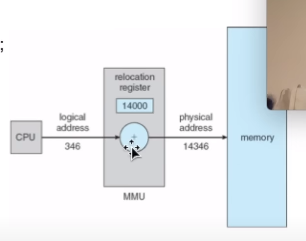

# ISLETIM SISTEMLERINE GIRIS
- Operating System : A program that acts as an intermediary between a user of a computer and computer hardware. Goals are :
    1. Execute user programs and make solving user problems easier.
    2. Make the computer system convenient to use
    3. Use the computer hardware in an efficent manner.
- Computer Systems can be divided into four components
    1. Hardware
    2. Operating System
    3. Application Programs
    4. Users

- Birincil Hafiza : RAM, Ikincil Hafiza : Diskler

- What operating System do? 
    1. Ease of use, User don't care about resource utilization
    2. Must keep all users happy for shared computers
    3. Workstations(Dedicated systems) have dedicated resources but frequently use shared resources such as **servers**
    4. Some computers have little or no UI.
    5. Handheld computers are resource poor, but optimized for usabilty and battery life.
    6. OS is resources allocator(Manages all resources)
    7. OS control programs(Controls executing of programs)
    8. Prevents errors and improper use of the computer
    9. No universally accepted definition
    10. The one program running at all times on the computer is the **kernel**. Everything else is either a system program or an application program.

- Bootstrap program is loaded at power-up or reboot.
    1. Typically stored in ROM or EEPROM generally known as firmware
    2. Initializes all aspects of system
    3. Loads operating system kernel and starts execution

- Computer System Operation
    1. I/O devices and the CPU can execute concurrently
    2. Each device controller is in charge of a particular device type
    3. Each device controller has a local buffer
    4. CPU moves data from/to main memory to/from local buffers
    5. I/O is from the device to local buffer of controller
    6. Device controller informs CPU that it has finished its operation by causing interrupt.

- Common Functions of Interrupts
    1. Interrupt transfer control to the interrupt service routine generally, through **interrupt vector**, which contains the addresses of all the service routines
    2. Interrupt architecture must save the address of the interrupted instruction
    3. Incoming interrupts are disabled while another interrupt is being processed to prevent a lost interrupt
    4. A trap is a software-generated interrupt caused either by an error or a user request
    5. An operating system is **interrupt driven**
- Interrupt Handling
    1. The operating system preserves the state of the CPU by storing registers and the program counter
    2. Determines which type of interrupt has occured
        1. Polling
        2. Vectored interrupt system
    3. Separate segments of code determine what action should be taken for each type of interrupt

## I/O Structure
- After I/O starts, control returns to user program only upon I/O completion
    1. Wait instruction idles the CPU until the next interrupt
    2. Wait loop(contention for memory access)
    3. At most one I/O request is outstanding at a time, no simultaneous I/O processing

- After I/O starts, control returns to user program without waiting for I/O completion
    1. **System call** : Request to the operating system allow user to wait for I/O completion
    2. **Device-status table** : Contains entry for each I/O device indicating its type, address, and state
    3. Operating system indexes into I/O device table to determine device status and to modify table entry to include interrupt

- Direct Memory Access Structure
    1. Used for high-speed I/O devices able to transmit information at **close to memory speeds**
    2. Device controller transfers blocks of data from buffer storage directly to main memory without CPU intervention
    3. Only one interrupt is generated per block, rather than the one interrupt per byte

- Storage Structure
    1. Main memory - only large storage media that the CPU can access directly
        1. Random Access
        2. Typically volatile
    2. Secondary storage - extension of main memory that provides large **nonvolatile** storage capacity
    3. Magnetic disks - rigid metal or glass platters covered with magnetic recording metarial
        1. Disk surface is logically divided into **tracks**, which are subdivided into **sectors**
        2. The **disk controller** determines the logical interaction between the device and the computer

- Storage systems organized in hierarchy
    1. Speed
    2. Cost
    3. Volatility
- Caching - copying information into faster storage system, main memory can be viewed as a **cache** for secondary storage
- Storage device hierarchy : Registers -> Cache -> Main Memory -> Electronic disk -> Magnetic Disk -> Optical Disk -> Magnetic tapes

## Caching
- Important principle, performed at many leves in a computer(Hardware, operating system, software)
- Information is use copied from slower to faster storage temporaily
- Faster storage(cache) checked first to determine if information is there
    1. If it is, information used directly from the cache
    2. If not, data copied to cache and used there
- Cache smaller than storage being cached
    1. Cache management important design problem
    2. Cache size and replacement policy

## Computer-System Architecture
- Most systems use a single general-purpose processor
    1. Most systems have special-purpose processors as well
- **Multiprocessors** systems growing in use and importance
    1. Also known as paralel system, **tightly-coupled systems**
    2. Advantages include
        1. Increased throughput
        2. Economy of scale
        3. Increased reliability -graceful degradation or fault tolerance
    3. Two types
        1. Asymmetric Multiprocessing
        2. Symmetric Multiprocessing

## Clustered Systems
- Like multiprocessor systems, but multiple systems working together
    1. Usually sharing storage via **storage-area network(SAN)**
    2. Provides a **high-availabilty** service which survives failures
        1. **Asymmetric clustering** has one machine in hot-standby mode
        2. **Symmetric clustering** has multiple nodes running applications, monitoring each other
    3. Some clusters are for **high-performance computing(HPC)**
        1. Applications must be written to use **parallelization**

## Operating System Structure
- **Multi programming** needed for efficency
    1. Single user cannot keep CPU and I/O devices busy at all times
    2. Multiprogramming organizes jobs(code and  data) so CPU always has one to execute
    3. A subset of total jobs in system is kept in memory
    4. One job selected and run via **job scheduling**

- **Timesharing(Multi-tasking)** is logical extension in which CPU switches jobs so frequently that user can interact with each job while it is running, creating **interactive** computing
    1. **Response time** should be <1 second
    2. Each user has at least one program executing in memory -> **process**
    3. If several jobs ready to run at the same time -> **CPU scheduling**
    4. If processes don't fit in memory, **swapping** moves them in and out to run
    5. **Virtual memory** allows execution of processes not completely in memory

## Operating-System Operations
- Interrupt driven by hardware
- Software error or request creates **exceptions** or **trap**
    1. Divison by zero, request for operating system service
- Other process problems include infinite loop, processes modifying each other or the operating system
- **Dual-mode** operation allows OS to protect itself and other system components
    1. **User mode** and **kernel mode**
    2. **Mode bit** provided by hardware
        1. Provides ability to distinguish when system is running user code or kernel code
        2. Some instructions designated as **privileged**, only executable in kernel mode
        3. System call changes mode to kernel, return from call resets it to user

- Timer to prevent innfinite loop / process hogging resources
    1. Set interrupt after specific period
    2. Operating system decrements counter
    3. When counter zero generate an interrupt
    4. Set up before scheduling process to regain control or terminate program that exceeds allotted time

## Process Management
- A process is a program in execution. It is a unit of work within the system. Program is a passive entity, process is an active entity
- Process needs resources to accomplish its task
    1. CPU, memory, I/O, files
    2. Initialization data
- Process termination requires reclaim of any reusable resources
- Single-threaded process has one program counter specifying location of next instruction to execute
    1. Process executes intructions sequentially, one at a time, until completion
- Multi-threaded process has one program counter per thread.
- Typically system has many processes, some user, some operating system running concurrently on one or more CPUs
    1. Concurrency by multiplexing the CPUs among the processes / threads

### Activities
- The operating system is responsible for the following activities in connection with process management
    1. Creating and deleting both user and system processes
    2. Suspending and resuming processes
    3. Providing mechanisms for process synchronization
    4. Providing mechanisms for process communication
    5. Prodiving mechanisms for deadlock handling.

## Memory Management
- All data in memory before and after processing
- All instructions in memory in order to execute
- Memory management determines what is in memory when
    1. Optimizing CPU utilization and computer response to users
- Memory management activities
    1. Keeping track of which parts of memory are currently being used and by whom
    2. Deciding which processes(or parts thereof)and data to move into and out of memory
    3. Allocating and deallocating memory space as needed      

## Storage Management
- OS provides uniform, logical view of information storage
    1. Abstracts physical properties to logical storage unit - file
    2. Each medium is controlled by device(disk drive, tape drive)
- File-system management
    1. Files usually organized into directories
    2. Access control on most systems to determine who can access what
    3. OS activities include 
        1. Creating and deleting files and directories
        2. Primitives to manipulate files and dirs
        3. Mapping files onto secondary storage
        4. Backup files onto stable(non-volatile) storage media

## Mass-Storage MAnagement
- Usually disks used to store data that does not fit in main memory or data that must be kept for a "long" period of time
- Proper management is of central importance
- Entire speed of computer operation hinges on disk subsystem and its algorithms
- OS activities
    1. Free-space management
    2. Storage allocation
    3. Disk scheduling

- Some storage need not to be fast
    1. Tertiary storage includes optical storage, magnetic tape
    2. Still must be managed - by OS or application
    3. Varies between WORM(write-once, read-many-times) and RW(read-write)

## I/O Subsystem
- One purpose of OS is to hide peculiarities of hardware devices from the user
- I/O subsystem responsible for
    1. Memory management of I/O including buffering(storing data temporarily while it is being transferred), caching(storing parts of data in faster storage for performance), spooling(the overlapping of output of one job with input of other jobs)
    2. General device-driver interface
    3. Drivers for specific hardware devices

## Protection and Security
- **Protection** : Any mechanism for controlling access of processes or users to resources defined by the OS
- **Security** : Defense of the system against internal and external attacks
    1. Huge range, including denial-of-service, worms, viruses, identity, theft, theft of service
- Systems generally first distinguish among users, to determine who can do what
    1. User identities(user IDS, security IDs)include name and associated number, one per user
    2. User ID then associated with all files, processes of that user to determine access control
    3. Group identifier(**group ID**) allows set of users to be defined and controls manage, then also associated with each process, file
    4. **Privilege escalation** allows user to change to effective ID with more rights

## Special-Purpose Systems
- Real-time embedded systems most prevalent form of computers
    1. Vary considerable, special purpose, limited purpose OS, **Real-time OS**
- Multimedia systems
    1. Streams of data must be delivered according to time restrictions
- Handheld systems
    1. PDAs, smart phones, limited CPU, memory, power
    2. Reduced feature set OS, limited I/O

# Operating-System Structures

## Operating System Services
- Operating systems provide an enviroment for execution of programs and services to programs and users
- One set of operating-system services provides functions that are helpful to the user
    1. **User Interface(UI)** : Varies between Command-Line(CLI), Graphics User Interface(GUI), Batch
    2. **Program execution** : The system must be able to load a program into memory and to run that program, end execution, either normally or abnormally
    3. **I/O operations** : A running program may require I/O, which may involve a file or an I/O device
    4. **File-System manipulation** : The file system is of particular interest. Programs need to read and write files and directories, create and delete them, search them, list file information, permission management
    5. **Communications** : Process may exchange information, on the same computer or between computers over a network
    6. **Error Detection** : OS needs to be constantly aware of possible erros
    7. **Resource Allocation** : When multiple users or multiple jobs running concurrently, resources must be allocated to each of them
    8. **Accounting** : To keep track of which users use how much and what kinds of computer resources
    9. **Protection and security** : The owners of information stored in a multiuser or networked computer system may want to control use of that information, concurrent processes should not interfere with each other

- To access hardware, User applications should do via Operating system. There is no other way possible generally.

- CLI or **command interpreter** allows direct command entry
    1. Sometimes implemented in kernel, sometimes by systems program
    2. Sometimes multiple floavors implemented - **shells**
    3. Primarily fetches a command from user and executes it
    4. Sometimes commands built-in, sometimes just names of programs

- User friendly **desktop** metaphor interface
    1. Usually mouse, keyboard and monitor
    2. **Icons** represent files, programs, actions, etc
    3. Various mouse buttons over objects in the interface cause various actions
    4. Invented at Xerox PARC
- Many systems now include both CLI and GUI interfaces
- Touchscreen devices require new interfaces.

## System Calls
- Programming interface to the services provided by the OS
- Typically written in a high-level language(C or C++)
- Mostly accessed by programs via a high-level **Application Programming Interface(API)** rather than direct system call use
- Three most common APIs are Win32 API, POSIX API for POSIX Based Systems(UNIX, Linux, Mac OS X) and Java API for JVM

- Often, more information is required than simply identity of desired system call
    1. Exact type and amount of information vary according to OS and call
- Three general methods used to pass parameters to the OS
    1. Simplest : Pass the parameters in Registers
    2. Parameters stored in block, or table in memory and address of block passed as a parameter in a register
    3. Parameter placed or pushed, onto the stack by the program and popped off the stack by the operating system
    4. Block and stack methods do not limit the number or length of parameters being passed

## Types of System Calls
- Process Control
    1. Create process, terminate process
    2. end, abort
    3. load, execute
    4. Get process attributes, set process attributes
    5. Wait for time
    6. Wait Event, signal event
    7. Allocate and free memory
    8. Dump memory if error
    9. **Debugger** for determining **bugs**, **single step** execution
    10. **Locks** for managing access to shared data between processes
- File management
    1. Create file, delete file
    2. Open, close file
    3. Read, write, reposition
    4. Get and set file attributes
- Device management
    1. Request device, release device
    2. Read, write, reposition
    3. Get device attributes, set device attributes
    4. Logically attach or detach devices
- Information maintenance
    1. Get time or date, set time or date
    2. get system data, set system data
    3. Get and set process, file or device attributes
- Communications
    1. Create, delete communication connection
    2. Send, receive messages if **message passing model** to **hostname** or **process name**
    3. **Shared-memory model** create and gain access to memory regions
    4. Transfer status information
    5. Attach and detach remote devices
- Protection
    1. Control access to resources
    2. Get and set permissions
    3. Allow and deny user access

## System Programs
- System programs provide a convenient environment for program development and execution. 
    1. File manipulation
    2. Status information sometimes stored in a File modification
    3. Programming language support
    4. Program loading and execution
    5. Communications
    6. Background services
    7. Application programs
- Most users view of the operating system is defined by system programs, not the actual system calls.
- Provide a convenient enviroment for program development and execution
- **File management** : Create, delete, copy, rename, print, dump, and generally manipulate files and directories
- **Status information** : Some ask the system for info-date, time, amount of available memory, disk space, number of users
- **File modifications** : Text editors to create and modify files
- **Programming-language support** : Compilers, assemblers, debuggers, interpreters
- **Program loading and execution** : Absolute loaders, relocatable loaders, linkage editors and overlay loaders
- **Communications** : Provide the mechanism for creating virtual connections among processes, users, and computer systems

# Processes

## Process Concept
- An operating system executes a variety of programs
    1. Batch system - **jobs**
    2. Time-shared systems - **user programs** or **tasks**
- Textbook uses the term **job** and **process** almost interchangeably
- **Process** a program in execution process execution must progress in sequential fashion
- Multiple parts
    1. The program code, also called **text section**
    2. Current activity including **program counter**, processor register
    3. **Stack** containing temporary data
    4. **Data section** containing global variabes
    5. **Heap** containing memory dynamically allocated during run time
- Program is **passive** entity stored on disk process(**executable file**) is **active**
    1. Program becomes process when executable file loaded into memory
- Execution of program started via GUI mouse clicks, command line entry of its name
- One program can be several processes
    1. Consider multiple user executing the same program

## Process States
- As a process executes, it changes **state**
    1. **new** : The process is being created
    2. **running** : Instructions are being executed
    3. **waiting** : The process is waiting for some event to occur
    4. **ready** : The process is waiting to be assigned to a processor
    5. **terminated** : The process has finished execution

## Process Control Block(PCB)
- Information associated with each process(also called **task control block**)
- Process state, running, waiting, etc
- Program counter - location of instruction to next execute
- CPU registers - contents of all process-centric register
- CPU scheduling information - priorities, scheduling queue pointers
- Memory-management information memory allocated to the process
- Accounting information - CPU used, clock time elapsed since start, time limits
- I/O status information - I/O devices allocated to process, list of open files.

## Threads
- So far, process has a single thread of execution
- Consider having multiple program counters per process
    1. Multiple locations can execute at once
- Must then have storage for thread details multiple program counters in PCB

## Process Scheduling
- Maximize CPU use, quickly switch processes onto CPU for time sharing
- **Process scheduler** selects among available processes for next execution on CPU
- Maintains scheduling **queues** of processes
    1. **Job queue** - set of all processes in the system
    2. **Ready queue** : Set of all processes residing in main memory, ready and waiting to execute
    3. **Device queues** : Set of processes waiting for an I/O device 
    4. Processes migrate among the various queues

## Schedulers
- **Short-term scheduler** or (**CPU Scheduler**) - selects which process should be executed next and allocates CPU
    1. Sometimes the only scheduler is a system
    2. Short-term scheduler is invoked frequently(millisecond)
- **Long-term scheduler** or (job scheduler) selects which process should be brought into the ready queue
    1. Long-term scheduler invoked infrequently(seconds, minutes)
    2. The long-term scheduler controls the **degree of multiprogramming**
- Processes can be described as either
    1. **I/O-bound process** : Spends more time doing I/O than computations, many short CPU bursts
    2. **CPU-bound process** : Spends more time doing computations, few very long CPU bursts
- Long-term scheduler strives for good **process mix**

## Context Switch
- When CPU switches to another process, the system must **save the state** of the old process and load the **saved state** for the new process via a **context switch**
- **Context** of process represented in the PCB
- Context-switch time is overhead, the system does no useful work while switching
    1. The more complex the OS and the PCB, the longer the context switch
- Time dependent on hardware support
    1. Some hardware provides multiple sets of registers per CPU

## Process Creation
- **Parent** process create **children** processes, which, in turn create other processes, forming a **tree** of processes
- Generally, process identified and manage via a **process identifier(pid)**
- Resource sharing options
    1. Parent and children share all resources
    2. Children share subset of parents resources
    3. Parent and child share no resources
- Execution options
    1. Parent and children execute concurrently
    2. Parent waits until children terminate
- Address space
    1. Child duplicate of parent
    2. Child has a program loaded into it
- Unix examples 
    1. fork() system call creates new process
    2. exec() system call used after a fork() to replace the process memory space with a new program

## Process Termination
- Process executes last statement and then asks the operating system to delete it using the **exit()** system call.
    1. Returns status data from child to parent(via wait())
    2. Process resources are deallocated by operating system
- Parent may terminate the execution of children processes using the **abort()** system call. Some reasons for doing so
    1. Child has exceeded allocated resources
    2. Task assigned to child is no longer required
    3. The parent is existing and the operating system does not allow a child to continue if its parent terminates
- Some operating systems do not allow child to exists if its parent has terminated. If a process terminates, then all its children must also be terminated.
    1. Cascading termination. All children, grandchildren are terminated
    2. The termination is initiated by the operating system
- The parent process may wait for termination of a child process by using the **wait()** system call. The call returns status information and the pid of the terminated process.
- If no parent waiting(didnt invoke wait()) process is a **zombie**
- If parent terminated without invoking **wait()**, process is an **orphan**

# Threads

## Multicore Programming 
- **Multicore** or **Multiprocessor** systems putting pressure on programmers, challenges include
    1. **Dividing activities**
    2. **Balance**
    3. **Data splitting**
    4. **Data dependency**
    5. **Testing and debugging**
- **Parallelism** implies a system can perform more than one task simultaneously
- **Concurrency** supports more than one task making progress
- Types of parallelism
    1. **Data parallelism** : Distrubtes subsets of the same data across multiple cores, some operation on each
    2. **Task parallelism** : Distributing threads across cores, each thread performing unique opeartion
- As # of threads grows, so does architectural support for threading
    1. CPUs have cores as well as **hardware threads**

## User Threads and Kernel Threads
- **User Threads** - management done by user-level threads library
- Three primary threads libraries
    1. POSIX Pthreads
    2. Windows Threads
    3. Java Threads

- **Kernel Threads** - Supporte by the kernel
- Examples - virtually all general purpose operating systems, including
    1. Windows
    2. Solaris
    3. Linux
    4. Tru64 UNIX
    5. Mac OS X

## Multi-Threading Models
- **Many-to-One** : Many user-level threads mapped to single kernel thread. One thread blocking causes all to block.
- **One-to-One** : Each user-level thread maps to kernel thread. Creating user-level thread creates kernel thread. More concurrency than many-to-one
- **Many-to-Many** : Allow many user level threads to be mapped to many kernel threads. Allows the operating system to create a sufficent number of kernel threads.

## Two-Level Model
- Similiar to many-to many except that allows a user thread to be **bound** to kernel thread

# Process Synchronization
- **Race Condition** : When one or more process runs at same time, Doesnt guarantee who will run first.

## Critical Section Problem
- Consider System of **n** processes{p0, p1, p2, pn-1}
- Each process has **critical section** segment of code
    1. Process may be changing common variables, updating table, writing file
    2. When one process in critical section, no other may be in critical section
- **Critical section problem** is to design protocol to solve this
- Each process must ask permission to enter critical section in **entry section**, may follow critical section with **exit section** then **remainder section**

## Solution to Critical-Section Problem
- **Mutual Exclusion** : If process Pi is executing in its critical section, then no other processes can be executing in their critical sections
- **Progress** : If no process is executing in its critical section there exist some processes that wish to enter their critical section, then the selection of the processes that will enter the critical section next cannot be postponed indefinetly
- **Bounded Waiting** : A bound must exist on the number of times that other processes are allowed to enter their critical sections after a process has made a request to enter its critical section and before that request is granted.
    1. Assume that each process executes at a nonzero speed
    2. No assumption concerning **relative speed** of the **n** processes

## Critical Section Handling
- Two approaches depending on if kernel is preemptive or non-preemptive
    1. **Preemptive** : Allow preemption of process when running in kernel mode
    2. **Non-Preemptive** : Runs until exits kernel mode, blocks, or voluntarily yields CPU

## Synchronization Hardware
- Many system provide hardware support for implementing critical section code
- All solutions below based on idea of **locking**
    1. Protecting critical regions via locks
- Uniprocessors - could disable interrupts
    1. Currently running code would execute without preemption
    2. Generally too inefficent on multiprocessor systems
        1. Operating systems using this not broadly scalable
- Modern machines provide special atomic hardware instructions
    1. Atomic = non-interruptable
    2. Either test memory word and set value
    3. Or swap contents of two memory words.

## Mutex Locks
- Previous solutions are complicated and generally inaccessible to application programmers
- OS designers build software tools to solve critical section problem
- Simplest is mutex lock
- Protect a critical section by first **acquire()** a lock then **release()** the lock
    1. Boolean variable indicating if lock is available or not
- Calls to **acquire()** and **release()** must be atomic
    1. Usually implemented via hardware atomic instructions
- But this solution requires busy **waiting**
    1. This lock therefore called a **spinlock**

## Semaphore
- Synchronization tool that provides more sophisticated ways process to synchronize their activities
- Can only be accessed via two indivisible(atomic) operations
    1. **wait()** and **signal()** : Originally called P() and V()

## Semaphore Usage
- **Counting Semaphore** : Integer value can range over an unrestricted domain
- **Binary Semaphore** : Integer value can range only between 0 and 1
    1. Same as a **mutex lock**
- Can solve various synchronization problems
- Can implement a counting semaphore as a binary semaphore

## Semaphore Implementation
- Must guarantee that no two processes can execute the **wait()** and **signal()** on the same semaphore at the same time.
- Thus, the implementation becomes the critical section problem where the **wait** and **signal** code are placed in the critical section
    1. Could now have **busy waiting** in critical section implementation
- Note that applications may spend lots of time in critical sections and therefore this is not a good solution

## Semaphore Implementation with no Busy Lock
- With each semaphore there is an associated waiting queue
- Each entry in a waiting queue has two data items
    1. Value(of type integer)
    2. Pointer to next record in the list
- Two operations
    1. **Block** : Place the process invoking the operating on the appropriate waiting queue
    2. **wakeup** : Remove one of processes in the waiting queue and place it in the ready queue.

## Deadlock and Starvation
- **Deadlock** : Two or more processes are waiting indefinetly for event that can be caused by only one of the waiting processes
- **Starvation - indefinite blocking** : A process may never be removed from the semaphore queue in which it is suspended
- **Priority Inversion** : Scheduling problem when lower priority process holds a lock needed by higher-priority process
    1. Solved via **priority-inheritance protocol**

## Monitors
- A high-level abstraction that provides a convenient and effective mechanism for process synchronization
- Abstract data type, internal variables only accessible by code within procedure
- Only one process may be active within the monitor at a time
- But not powerful enough to model some synchronization schemes

# CPU Scheduling
- **Cycle** : Atomic. Non-divisible.
- Operating system must have process management.

## CPU Scheduler
- **Short-term scheduler** selects from among the processes in ready queue, and allocates the CPU to one of them
    1. Queue may be ordered in various ways
- CPU scheduling decisions may take place when a proocess
    1. Switches from running to waiting state
    2. Switches from running to ready state
    3. Switches from waiting to ready
    4. Terminates
- Scheduling under 1 and 4 is non **non-preemptive**
- All other scheduling is **preemptive**
    1. Consider access to shared data
    2. Consider preemption while in kernel mode
    3. Consider interrupts occuring during crucial OS activities

## Dispatcher
- Dispatcher module gives control of the CPU to the process selected by the short-term scheduler, this involves
    1. Switching context
    2. Switch to user mode
    3. Jumping to the proper location in the user program to restart that program
- **Dispatch latency** - Time it takes for the dispatcher to stop one process and start another running

## Scheduling Criteria
- **CPU utilization** : Keep the CPU as busy as possible
- **Throughput** : # of processes that complete their execution per time unit
- **Turnaround time** : Amount of time to execute a particular process
- **Waiting time** : Amount of time a process has been waiting in the ready queue.
- **Response time** : Amount of time it takes from when a request was submitted until the first response is produced, not output(for time-sharing enviroment)
- Scheduling Algorithm Optimization
    1. Max CPU utilization
    2. Max throughput
    3. Min turnaround time
    4. Min waiting time
    5. Min response time

## Scheduling Algorithms
- In real life, before running the process, it is not possible to know how long it will take in CPU.
### First-Come, First-Served(FCFS) Scheduler
- This is implemented in fifo queue.
- First come first served basically.
- **Convoy Effect** : Short process behind long process.

### Shortest-Job-First (SJF) Schedling
- Associate with each process the length of its next CPU burst
- SJF is optimal - gives minimum averae waiting time for a given set of processes.
    1. The difficulty is knowing the length of the next CPU request
- It is non-preemptive
### Shortest-Remaining-Time-First
- This takes account the arrival time and time remaining to complete. The one with shortest time left is scheduled.
- It is preemptive.

### Priority Scheduling
- A priority number(integer) is associated with each process
- The CPU is allocated to the process with the highest priority(smallest integer = highest priority)
    1. Preemptive
    2. Non-Preemptive

- SJF is priority scheduling where priority is the inverse of predicated next CPU burst time
- Problem = **Starvation** - low priority processes may never execute
- Solution = **Aging** - As time progresses increase the priority of the process

### Round Robin(RR)
- Each process gets a small unit of CPU time(**time quantum** q), usually 10-100 milliseconds. After time time has elapsed, the process is preempted and added to the end of the ready queue.
- If there are n process in the ready queue and the time quantum is q, then each process gets 1/n of the CPU time in chunks of at msot q time units at once. No process waits more than (n - 1)q time units
- Timer interrupts every quantum to schedule next process.
- Performance
    1. q large -> FIFO
    2. q small -> q must be large with respect to context switch, otherwise overhead is too high.

### Multi-Level Queues
- Ready queue is partitioned into separate queues
    1. **Foreground** : Interactive
    2. **Background** : Batch
- Process permanently in given queue
- Each queue has its own scheduling algorithm
    1. **Foreground** : Round-Robin
    2. **Background** : First Come - First Served
- Scheduling must be done between queues
    1. Fixed priority scheduling(serve all from foreground then from background). Possibility of starvation
    2. Time slice - Each queue gets a certain amount of CPU time which it can schedule amongst its processes. ie %80 to foreground in RR
    3. %20 to background in FCFS

# Deadlocks
- The key of deadlock is process cant finish and wait each other.
- If graph contains no cycles -> No deadlock
- If graph contains a cycle
    1. If only one instance per resource type, then deadlock
    2. If several instances per resource type, possibility of deadlock.
## Deadlock Characterization
- Deadlock can arise if four conditions hold simultneously
    1. **Mutual Exclusion** : Only one process at a time can use a shared resource
    2. **Hold and wait** : A process holding at least one resource waiting to acquire additional resources held by other processes
    3. **No preemption** : A resource can be released only voluntarily by the process holding it, after that process has completed its task
    4. **Circular wait** : There exist a set {P0, P1, ..., Pn} of waiting processes such that P0 is waiting for a resource that is held by P1, P1 is waiting for resource that is held by P2, ... Pn-1 is waiting for a resource that is held by Pn and Pn is waiting for a resource that is held by P0

## Methods for Handling Deadlocks
- Ensure tht the system will **never** enter a deadlock state.
    1. Deadlock prevention
    2. Deadlock avoidence
- Allow the system to enter a deadlock state and then recover
- Ingore the problem and pretend that deadlocks never occur in the system, used by most opereating systems including UNIX

## Deadlock Prevention
- Restrain the ways request can be made
- **Mutual Exclusion** : Not required for sharable resources(e.g read-only files), must hold for non-sharable resource
- **Hold and Wait** : Must guarantee that whenever a process request a resource, it does not hold any other resources
    1. Require process to request and be allocated all its resources before it begins execution, or allow process to request resources only when the process has none allocated to it.
    2. Low resource utilization; starvation possible.
- **No Preemption** : 
    1. If a process that is holding some resources requests another resource that cannot be immediately allocated to it, then all resources currently being held are released
    2. Preempted resources are added to the list of resources for which the process is waiting
    3. Process will be restarted only when it can regain its old resources, as well as the new ones that it is requesting
- **Circular Wait** : Impose a total ordering of all resources types, and require that each process requests resources in an increasing order of enumeration.

## Deadlock Avoidance
- Requires that the system has some additional **a priori** information avaiable
- Simplest and most usefull model requires that each process declare the **maximum number** of resources of each type that it may need.
- The deadlock-avoidance algorithm dynamically examines the resource-allocation state to ensure that there can never be a circular-wait condition
- Resource-allocation state is defined by the number of available and allocated resources, and the maximum demands of the processes.

- If a systems is in safe state -> no deadlocks
- If a system is in unsafe state -> Possiblity of deadlocks
- Avoidance -> Ensure that a system will never enter an unsafe state.

- Avoidance Algorithms
    1. Single Instance of a resource type  
        1. Use a resource-allocation graph
    2. Multiple instances of a resource type
        1. Use the banker's algorithm

### Banker Algorithm
- Multiple instances
- Each process must a priori claim maximum use
- When a process requests a resource it may have to wait
- When a process gets all its resources it must return them in a finite amount of time

# Memory Management
- Program must be brought(from disk) into memory and placed within a process for it to be run
- Main memory and registers are only storage CPU can access directly
- Memory unit only sees a stream of addresses + read requests, or address + data and write requests
- Register access is on CPU Clock(or less)
- Main memory can take many cycles, causing a **stall**
- **Cache** sits between main memory and CPU registers
- Protection of memory required to ensure correct operation.
- Each process lives in its own address space.

## Base and Limit Registers
- A pair of **base** and **limit registers** define the logical address
- CPU must check every memory access generated in user mode to be sure it is between base and limit for that user

## Address Binding 
- Programs on disk, ready to be brought into memory to execute from an **queue**
    1. Without support, must be loaded into address 0000
- Inconvenient to have first process physical address always at 0000
- Further, addresses represented in different ways at different stages of program's life
    1. Source code addresses usually symbolic
    2. Compiled code addresses **bind** to relocatable addresses
        1. I.E. : 14 bytes from beginning of this module
    3. Linker or loader will bind relocatable addresses to absolute addresses
        1. I.E : 74014
    4. Each binding maps one address space to another.

## Binding of Instructions and Data to RAM
- Address binding of instructions and data to memory addresses can happen at three different stages
    1. **Compile time** : If memory location known a priori **absolute code** can be generated, must recompile code if starting location changes
    2. **Load time** : Must generate **relocatable code** if memory location is not known at compile time.
    3. **Execution time** : Binding delayed until run time if the process can be moved during its execution from one memory segment to another.

## Logical vs Physical Address
- The concept of a logical address space that is bound to a separate **physical address space** is central to proper memory management
    1. **Logical Address** : Generated by the CPU, also refered to as **virtual address**
    2. **Physical Address** : Address seen by the memory unit
- Logical and physical addresses are the same in compile-time and load-time address-binding schemes; logical(virtual) and physical addresses differ in execution-time address-binding scheme
- **Logical address space** is the set of all logical addresses generated by a program
- **Physical address space** is the set of all physical addresses generated by a program.

## Dynamic relocation using a relocation register
- Routine is not loaded until it is called
- Better memory-space utilization; unused routine is never loaded
- All routines kept on disk in relocatable load format
- Useful when large amounts of code are needed to handle infrequently occuring cases
- No special support from the operating system is required
    1. Implemented through program design
    2. OS can help by prodiving libraries to implement dynamic loading

## Dynamic Linking 
- **Static Linking** : System libraries and program code combinied by the loader into the binary program image
- Dynamic linking - linking postponed until execution time
- Small piece of code, **stub**, used to locate the appropriate memory-resident library routine
- Stub replaces itself with the address of the routine, and executes the routine
- Operating system checks if routine is in processses memory address
    1. If not in address space, add to address space
- Dynamic linking is particualarly useful for libraries
- System also known as **shared libraries**
- Consider applicability to patching system libraries
    1. Versioning may be needed.

## Swapping
- A process can be **swapped** temporarily out of memory to a backing store, and then brought back into memory for continued execution
    1. Total physical memory space of processes can exceed physsical memory
- **Backing store** : Fast disk large enough to accomodate copies of all memory images for all users; must provide direct access to these memory images
- **Roll out, roll in** : Swapping variant used for priority-based scheduling algorithms; lower-priority process is swapped out so higher-priority process can be loaded and executed.
- Major part of swap time is transfer time; total transfer time is directly proportional to the amount of memory swapped
- System maintains  a **ready queue** of ready-to-run processes which have memory images on disk

## Multiple-Partition Allocation
- Multiple-partition allocation
    1. Degree of multiprogramming limited by number of partitions
    2. **Variable-partition** sizes for efficency(sized to a give process)
    3. **Hole** - block of available memory; holes of various size of scattered throughout memory. 
    4. When a process arrives, it is allocated memory from a hole large exit to accommodate it
    5. Process existing frees its partition, adjacent free partitions combined
    6. Operating system maintains information about
        1. Allocated partitions
        2. Free Partitions(Hole)

## Dynamic Storage-Allocation Program
- How to satisfy a request of size **n** from a list of free holes
- **First-fit** : Allocate the **first** hole that is big enough 
- **Best-fit** : Allocate the **smallest** hole that is big enough must search entire lsit, unless ordered by size
- **Worst-fit** : Allocate the **largest** hole; must also search entire list
- First-fit and best-fit better than worst-fit in terms of speed and storage utilization

## Fragmentation
- **External Fragmentation** : Total memory space exists to satisfy a request, but it is not contiguous
- **Internal Fragmentation** : Allocated memory may be slightly larger than requested memory; this size difference is memory internal to a partition, but not being used
- First fit analysis reveals that given N blocks allocated 0.5 blocks lost to fragmentation
- Reduce external fragmentation by **compaction**
    1. Shuffle memory contents to place all free memory together in one large block
    2. Compaction is possible only if relocation is dynamic, and is done at execution time

## Segmentation
- Memory-management scheme that supports user view of memory
- A program is collection of segments. A segment is logical unit such as :
- Main Program, Procedure, Function, Method, Object, Local Variables, Global variables, Common Block, Stack, Symbol Table, Arrays

## Segmentation Architecture
- **Segmentation table** : Maps two-dimensional physical addresses, Each table has :
    1. **base** : Contains the starting physical address where the segments reside in memory
    2. **limit** : Specifies the length of the segment
- **Segment-table base register(STBR)** : Points to the segment table's location in memory
- **Segment-table length register(STLR)** : Indicates number of segments used by a program

## Paging
- Physical address space of a process can be noncontiguous process is allocated physical memory whenever the latter is available
    1. Avoids external fragmentation
    2. Avoids problem of varying size memory chunks
- Divide physical memory into fixed-sized blocks called **frames**
-   1. Size is power of 2, between 512 bytes and 16 Mbytes
- Divide logical memory into blocks of same size called pages
- Keep track of all free frames
- To run a prograam of size **N** pages, need to find **N** free frames and load program
- Set up a **page table** to translate logical to physical addresses
- Backing store likewise split into pages
- Still have Internal fragmentation

# Mass-Storage Systems
- **Magnetic disks** provides bulk of secondary storage of mode
    1. Drives rotate at 60 to 250 times per second
    2. **Transfer rate** is rate at which data flow between drive
    3. **Positioning time(random-access time)** is time find desired cylinder(**seek time**) and time for desired section under the disk head(**rotational latency**)
    4. **Head crash** results from disk head making contact with the disk surface -- That's bad
- Disk can be removable
- Drive attached to computer via **I/O bus**
    1. Busses vary, including **EIDE, ATA, SATA, USB, Fibre Channel, SCSI, SAS, Firewire**
    2. **Host controller** in computer uses bus to talk to **disk controller** built into drive or storage array

## Magnetic Tape
-  Was early secondary-storage medium
- Relatively permanent and holds large quantities of data
- Access time slow
- Random access~1000 times slower than disk
- Mainly used for backup, storage of infrequently-used data, transfer medium between systems
- Kept in spool and wound or rewound past read-write head
- Once data under head, transfer rates comparable to disk
- 200GB to 1.5TB Typical storage

## Disk Structure
- Disk drives are addressed as large 1-dimensional arrays of **blocks** where the logical block is the smallest unit of transfer
- The 1-dimensinonal array of logical blocks is mapped into the sectors of the disk sequentially

# File-System Interface
- Contiguous logical address space
- Types : 
    1. Data : Numeric, Character, binary
    2. Program
- Contents defined by file's creator
    1. Many types : Text file, source file, executable file, ...

## File Attributes
- **Name** : Only information kept in human-readable form
- **Identifier** : Unique tag(number) identifies file within file system
- **Type** : Needed for systems that support different types
- **Location** : Pointer to file location on device
- **Size** : Current file size
- **Protection** : Controls who can do reading, writing, executing
- **Time, date and user identification** : Data for protection, security and usage monitoring
- Information about files are kept in the directory structure which is maintained on the disk
- Many variations including extended file attributes such as file checksum
- Information kept in the directory structure

## File Operations
- File is an **abstract data type** 
- **Create**, **Write** -at **write pointer** location, **Read** - at **read pointer** location
- **Reposition within file** - seek
- **Delete**
- **Truncate**
- **Open(Fi)** : Search the directory structure on disk for entry Fi and move the content of entry to memory
- **Close(Fi)** : Move the content of entry Fi in memory to diectory structure on disk

## Open files
- Several pieces of data are needed to manage open files
    1. **Open-file table** : Tracks open files
    2. **File Pointer** : Pointer to last read/write location, per process that has the file open
    3. **File-open count** : Counter of number of times a file is open - to allow removal of data from open-file table when last processes closes it
    4. **Disk location of the file** : Cache of data access information
    5. **Access rights** Per-Process access mode information

## Open File Locking
- Provided by some operating systems and file systems
    1. Similiar to reader-writer locks
    2. **Shared lock** similiar to reader lock - several processes can acquire concurrently
    3. **Exclusive lock** similar to writer lock
- Mediates access to a file
- Mandatory or advisory
    1. **Mandatory** : Access is denied depending on locks held and requested
    2. **Advisory** : Processes can find status of locks and decide what to do

## File Structure
- None - sequence of words, bytes
- Simple Record Structure : Lines, Fixed Length, Variable Length
- Complex Structure : Formatted document, Relocatable load file
- Can simulate last two with first method by inserting appropriate control characters
- Who Decides : Operating System, Program 

## Disk Structure
- Disk can be subdivided into **partitions**
- Disks or partitions can be **RAID** protected against failure
- Disk or partition can be used **raw** - without a file system, or **formatted** with a file system
- Partitions also known as minidisks, slices
- Entity contaning file system known as a **volume**
- Each volume contanining file system also tracks that file system's info in **device directory** or **volume table of contents**
- As well as **general-purpose file systems** there are many **special-purpose file systems**, frequently all within the same operating system or computer

## File Sharing
- Sharing of files on multi-user systems is desirable
- Sharing may be done through a **protection** scheme
- On distributed systems, files may be shared across a network
- Network File System(NFS) is a common distributed file-sharing method
- If multi-user system
    1. **User IDs** identify users, allowing permissions and protections to be per-user, **Group IDs** allow users to be in groups, permitting group access rights

# File System Implementation

## File-System Structure
- File structure
    1. Logical storage unit
    2. Collection of related information
- **File system** resides on secondary storage(disks)
    1. Provided user interface to storage, mapping logical to partition
    2. Provides efficent and convenient access to disk by allowing data to be stored, located retrieved easily
- Disk provides in-place rewrite and random access
    1. I/O transfers performed in **blocks** of **sectors**
- **File control block** - storage structure consisting of information about a file
- **Device driver** controls the physical device
- File system organized into layers

# I/O Systems
- I/O management is a major component of operating system design and operation
    1. Important aspect of computer operation
    2. I/O devices vary greatly
    3. Various methods to control them
    4. Performance management
    5. New types of devices frequent
- Ports, busses, device controllers connect to various devices
- **Device drivers** encapsulate device details
    1. Present uniform device access interface to I/O subsystem

## I/O Hardware
- Incredible variety of I/O devices : Storage, Transmission, Human-Interface
- Common concepts - Signals from I/O devices interface with CPI
    1. **Port** : Connection point for device
    2. **Bus-daisy chain** or shared direct access
    3. **Controller(Host adapter)** : Electronics that operate port, bus, device
- I/O instructions control devices
- Devices usually have registers where device driver places commands, addresses, and data to write, or read data from registers after command execution
- Devices have addresses, used by 
    1. Direct I/O instructions
    2. Memory-mapped I/O

## Polling
- For each byte of I/O
    1. Read busy bit from status register until 0
    2. Host sets read or write bit and if write copies data into data register
    3. Host sets command-ready bit
    4. Controller sets busy bit, executes transfer
    5. Controller clears busy bit, error bit, command-ready bit when transfer done
- Step 1 is **busy-wait** cycle to wait for I/O from device
    1. Reasonable if device is fast
    2. But inefficent if device slow
    3. CPU swithces to other tasks

## Interrupts
- Polling can happen in 3 instruction cycles
    1. Read status, logical-and to extract status bit, branch if not busy
    2. How to be more efficent if non-zero infrequently
- CPU **interrupt-request line** trigged by I/O device
    1. Checked by processor after each instruction
- **Interrupt handler** receives interrupts
    1. **Maskable** to ignore or delay some interrupts
- **Interrupt vector** to dispatch interrupt to correct handler
    1. Context switch at start and end
    2. Based on priority
    3. Some **nonmaskable**
    4. Interrupt chaining if more than one device at same interrupt number
- Interrupt mechanism also used for **exceptions** 
    1. Terminate process, crash system due to hardware error
- Page fault executes when memory access error
- System call executes via **trap** to trigger kernel to execute request
- Multi-CPU systems can process interrupts concurrently
    1. If operating system designed to handle it
- Used for time sensitive processing, frequent, must be fast

## Direct Memory Access
- USed to avoid **programmed I/O**(one byte at a time) for large data movement
- Requires **DMA** Controller
- Bypasses CPU to transfer data directly between I/O device and memory
- OS writes DMA command block into memory
- Version that is aware of virtual addresses can be even more efficent - **DVMA**

## Application I/O Interface
- I/O system calls encapsulate device behaviors in generic classes
- Device-driver layer hides differences among I/O controllers fromUser
- New devices talknig already-implemented protocols need no extra work
- Each OS has its own I/O subsystem structures and device driver frameworks
- Devices vary in many dimensions
    1. **Character-steram** or **block**
    2. **Sequential** or **random-access**
    3. **Synchronous** or **asynchronous**
    4. **Sharable** or **dedicated**
    5. **Speed of operation**
    6. **Read-Write**, **Read only** or **Write only**

## Kernel I/O Subsystem
- **Caching** : Faster device holding copy of data
    1. Always just a copy
    2. Key to performance
    3. Sometimes combined with buffering
- **Spooling** : Hold output for a device
    1. If device can serve only on request at a time
- **Device reservation** : Provides exclusive access to a device
    1. System calls for allocation and de-allocation
    2. Watch out for deadlock

## Error Handling
- OS can recover from disk read, device unavailable, transient write failures
- Most return an error number or code when I/O request fails
- System error logs hold problem reports

# Proc File System
- Proc is abbrevation for Process.
- /proc directory is not a real file system
- It is Virtual File System
- Information about processes and other system information.
- It is mapped to /proc and mounted at boot time.

# Protection
