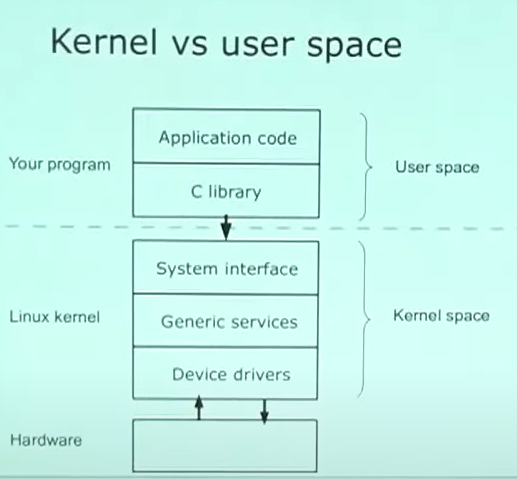

# The Embedded Linux Quick Start Guide

## In the Beginning
- Four key elements : Toolchain, bootloader, kernel, userspace

### Toolchain
- You can't do anything until you can produce code for your platform
- A toolchain consists of at least : Binutils(GNU assembler), gcc(GNU C compiler), libc(the interface to the operating system), gdb(debugger).
- **Native** : Run compiler on target board
- **Cross** : Compile on one machine, run on another

#### The C Library
- GCC is built along side the C library. Hence, the C library is part of the toolchain
- Main options are 
    1. GNU glibc : Big but fully functional
    2. GNU eglibc : glibc but more configurable, embedded-friendly
    3. uClibc : Small, lacking up-to-date threads library and other POSIX functions

#### Criteria for selecting a toolchain
- Good support for your processor
- Appropriate C library
- Up-to-date
- Good support

- Just with toolchain, you cant really write really interesting programs. After toolchain, we need to add libraries.

### Bootloader
- Initialises the hardware
    1. Setup SDRAM controller
    2. Map memory
    3. Set processor mode and features
- Load a kernel
- Optional(but very usefull)
    1. Load images via Ethernet, serial, SD Card
    2. Erase and program flash memory
    3. Display splash screen

- Pre-boot loader : 
    1. Usually stored in flash memory
    2. Sequence : Pre-boot loader -> Main boot loader -> kernel

- Loading Kernel : Primary task of boot loader is to
    1. Generate a description of the hardware (size and location of RAM, flash)
    2. Load a kernel image into memory
    3. Load a ramdisk image into memory
    4. Set the kernel command line
    5. Jump to kernel start vector, passing pointers to information about hardware and kernel command line.

- Examples of Bootloaders
    1. U-Boot
    2. Redboot
    3. For PC hardware : GRUB or LILO

## Kernel and Userspace

### Kernel

- User has no access to hardware. User writes code in given language, That translates to C library. That uses systems calls. Then that translated to device drivers. Then thats use necessary work on hardware. 
- Some kernel versions are maintained for longer time. If you want to compile your distro, then its better choice one of longer supported kernels(This kernel versions also called stable kernels)
#### Board Support Packages
- Mainline kernel works out-of-the-box for a number of development boards
- But in most cases you will need a BSP from the board or chip vendor
    1. Lags mainline by a few versions
    2. Levels of support vary between vendors
- For custom boards you will have to write your own BSP
- Levels of board support
    1. Architecture : ARM, MIPS, PowerPC, x86
    2. Chip(also knowns as SOC) : Atmel 91sam9, Freescale i.MX, TI OMAP...
    3. Board (Manufacturer evaluation boards) : Freescale Babbage, TI EVM...
#### Kernel Modules
- Kernel modules : Kernel code that is loaded after the kernel has booted
- Advantages
    1. Load drivers on demand
    2. Load drivers later(Speed up initial boot)
- Disadvantages
    1. Adds kernel version dependency to root file system
    2. More files to manage
#### Kernel configuration
- Typical kernel has >> 1000 configuration options
- Default configuration part of BSP
- Tweak configuration using
    1. make menuconfig(ncurses)
    2. make xconfig(Graphical using Qt)
    3. make gconfig(Graphical using GTK+)
- Files generated :
    1. .config
    2. include/linux/autoconf.h

### User Space
- User space : a sane POSIX enviroment for application unlike the kernel
- Main components are : Programs, Libraries, Configuration files, Device nodes, User data

#### Root File system
- Mounted by the kernel during boot
- Loaded from : 
    1. RAMdisk -> initramfs
    2. Storage device : flash, SD, harddisk
    3. Network : nfs

#### Busybox
- Address : http://www.busybox.net
- Very common in embedded systems
- Single binary that masquaredes asa many Linux utilities, including
    1. init
    2. ash(a Bourne shell)
    3. File system utilities : mount, unmount
    4. Network utilities : ifconfig, route...
    5. and ofcourse vi editor.

#### init
- /sbin/init is the first program to be run.(can be changes by setting kernel parameter init = ...)
- Two common version of init
    1. Busybox init
    2. System V init

#### /dev: Device nodes
- Most hardware appears as nodes in /dev
- Create by hand or use dynamic device manage(udev)
- Cross-over cable allowes to plug 2 device directly without needing any hub between. Basically with pc ethernet port to device directly.
