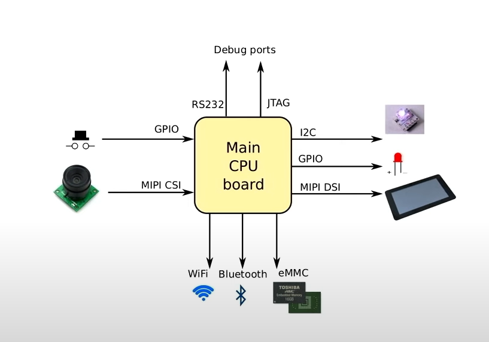

# Challanges of Embeddded Linux

## What is so special about embedded ?
- **Cost sensitive** : Cheapter to build your own hardware for given volume
- **Low power** - hardware often running 7/24, runinng cost becomes important
- **Low thermal footprint** - generally don't want noisy fan
- **Size matters** - device has fit in, often needs to be aesthetically pleasing
- **Longevity** - often expected to work continuously for many years

## Why Linux
- Linux is good choice for devices that cost upwards of a few 10s of dollars
    1. **Moore's law** : Complex hardware requires complex software
    2. **Free** : You have the **freedom** to get and modify the code, making it easy to adapt and extend
    3. **Functional** : Supports a very wide range of hardware
    4. **Up to date** : The kernel has a 10 week release cycle
    5. **Free** : There is no charge for using the source code
- Really cheap devices use single chip microcontrollers and run a simple RTOS such as Zephyr, NuttX, FreeRTOS...

## Challange 1 : No hardware compatilibty
- Standardizing hardware adds cost(PCs are expensive)
- Design hardware from scratch to do exactly what you want. But in this approach :
    1. developing code becomes harder.
    2. Hard to keep update.
    3. Manufactures not very interested once device sold

## Challange 2 : Developing Code
- Target system is not powerful enough to do native compilation
- Target device is usually not the same architecture or operating system as the dev system
- Conclusion is we are going to have to cross compile

### Cross Compiling
- We need a cross toolchain to compile C/C++
- GNU toolchains have by a prefix <code>arch-vendor-kernel-operatingsystem</code>
- For example <code>aarch64-buildroot-linux-gnu</code>
    1. arch = aarch64(ARM architecture 64)
    2. vendor = buildroot
    3. kernel = linux
    4. operating system = gnu

### Building the Operating System
- Building an operating system is more that just knowing how to use a cross compiler
- We have to
    1. Create a toolchain, or install precompiled binaries
    2. Build the bootloader for the specific target board
    3. Build the Linux kernel for the board
    4. Build the system deamons(init, network, logging, etc)
    5. Build the dependencies(e.g libraries) for all of the above
    6. Create images that can be written to the flash memory of the target
- In the past, we did all this with a combination of scripts and manual steps, Known as **Roll Your Own(RYO)** operating system.
- Device tree explains what is the peripherals are to the kernel.
### The Yocto Project
- The Yocto Project is a Linux Foundation project to maintain a build system for embedded Linujx
- Consist of 
    1. **oe-core** shared with OpenEmbedded
    2. **BitBake** : shared with OpenEmbedded
    3. **Poky** : the distribution metadata
    4. **Reference BSP** including BeagleBone
    5. **Documentation**, which is extensive

### Buildroot
- Builtroot has a lighter touch than Yocto meaning that the learning cure is less steep
- Generally used for smaller teams
- Without the resources of Linux Foundation, it is developed much more as a community project

## Challange 3 : Robust updates
- OEMs need to supply updates to add features and to fix security bugs
- Update using a package manager, e.g RPM or Deb, is not sufficently robust
    1. Updates are not atomic
    2. A failed update, e.g by losing power, can lead to inconsistent state of the packages
    3. The device is "bricked", meaning that it is useful as brick
- So we need to update the whole system image in flash memory, in atomic way

### A/B update
- Initially the bootloader loads the A partition slots
- An update is written and verified to the B slots(atomically)
- The bootloader next boots from the B slots
- If the boot fails for some reason, the bootloader switches back to the last good known good operating system
- Updates may be provided through a network download(Over The Air, OTA)
- Or, may be loaded from local storage, e.g a USB memory stick

### Examples of A/B updaters
- Both Yocto and Buildroot have packages that implement A/B image update, for example
    1. **swupdate** : https://swupdate.org/
    2. **RAUC(Robusy Auto Update Controller)** : https://rauc.io/
    3. **Mender** : https://mender.io/

## Challange 4 : Security
- The main requirement for the end user is :
    1. A device that is secure from outside interference, both local and remote access modes
- Usually implemented by locking device down so that 3rd parties(including the owner) cannot load new code
    1. Secure boot : boot code and kernel have to be signed with the manufacturers credentials
    2. Encrypted disk and user data
    3. Signed OTA images
- With secure boot, from hardware to kernel, we can use chain of trust. If done currently it can provide security so well.

## Challange 5 : Licensing
- **Copy left** licenses, e.g. GPL, do ensure that you can read the source code.
- **Permissive** licenses, e.g. BSD, MIT, Apache 2.0, do not require that the source be made public. 
    1. Very popular with most OEMs
