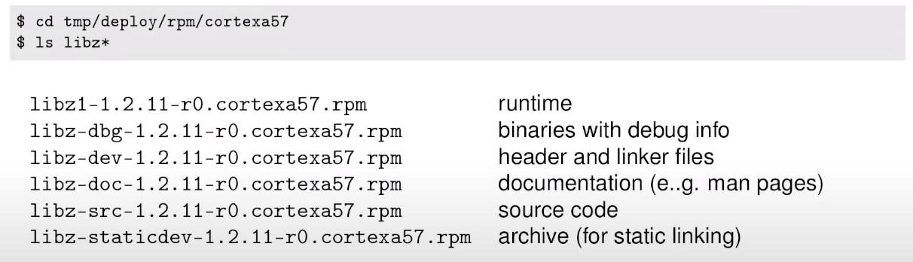

# Getting Started with Yocto Project
- With qemu emulator, we can native compiling the yocto project

## Embedded Hardware
- Types of hardware that are Linux capable
    1. Commodity hardware : Plug and play, Standart Distros
        1. Limited flexibility
        2. embedded PCs, x86, powerful, but expensive and high power requirment
        3. Raspberry Pi, cheap but not industry spe
    2. Bespoke hardware : Custom build 
        1. Cheaper(large volumes), less power dissipation, more flexible, physically smallar packages
        2. Mostly ARM
        3. RISC-V is catching up
    3. Semi-bespoke
        1. SBC, SOM

- Embedded hardware generally does not follow rigid standarts as PCs do
- For reasons of cost and flexibility, each project is unique
- Hence, off the self is not usually an option
- Mostly using ARM SoCs - which are cheap, low power, have lots of peripherals integrated into the chip


## Yocto Project
- Yocto project is build system that creates packages from source code
    1. Based on Bitbake and OpenEmbedded meta data
    2. Yocto Project and OpenEmbedded have been used to create the software running on many millions of devices
- Allows you to create your own tailor-made distro
- You only need to build and deploy the packages you need
- Yocto projects releases every 6 months in April and October
- Sometimes yocto developers picks a distro for Long Term Support(LTS) which is for 24 months.

### Getting Yocto Project
- Clone yocto from Yocto git repo.<code>git clone -b kirkstone git://git.yoctoproject.org/poky</code>
- Its just contains meta data.

### Setting up the enviroment
- Begin by sourcing this script <code>source ./oe-init-build-env "builddir"</code>
    1. Creates a working directory for your project, default as /build, if no builddir parameter is given
    2. Changes into that directory
    3. The directory path is stored in shell variable $BUILDDIR
    4. To return to this directory later just do <code>cd $BUILDDIR</code>
- You must call <code>source ./oe-init-build-env "builddir"</code> each time you use yocto project from a new shell
- Yocto directory layout


### Setting the build configuration
- Build configuration files are in $BUILDDIR/conf/
- The initial set is 
    1. **bblayers.conf** : list of directories containing layers
    2. **local.conf** : Local configuration

### 3 Concepts
- **Distro** : How I want to put my system together, for beginners usually poky used. Set in conf/local.conf selected by DISTRO 
- **Machine** : The board I want to build for : Thats the hardware;

- **Image** : The selection of packages I want : List of packages

### Bitbake and recipes
- OpenEmbedded uses **BitBake** to build the target
- Bitbake reads **recipes** to create a dependency tree
- Then executes all recipes required to build the final target
- To begin with we will build an **image** recipe

## Images
- They are specified by recepies
- Some Standart Recipes
    1. **core-image-minimal** : small console-based image, useful for tests and the basis for custom images
    2. **core-image-base** : A console-only image that fully supports the target device
    3. **core-full-cmdline** : A console-only image with full-featured Linux system functionality installed
    4. **core-image-x11** : small X11 server based graphical, including xterminal terminal app
    5. **core-image-sato** : Full graphical system based on Sato(a mobile GUI built on X11, and GNOME)

### Building an Image
- To build the image, simply run BitBake and the image name
- For example : <code>bitbake core-image-minimal</code>

### Shared State cache
- Binary build artifacts are put into the **shared state cache**
    1. Speeds up subsequent builds
    2. Can be shared with other developers

## Layers
- **BSP** : Defines a MACHINE and related board-specific packages : contains conf/machine/[MACHINE].conf
- **Distribution** : Defines a DISTRO such as Poky or Angstrom : Contains conf/distro/[DISTRO].conf
- **Software** : Everything else
    1. Contains neither conf/machine/[MACHINE].conf nor conf/distro/[DISTRO].conf
    2. libraries, e.g : qt5
    3. languages, e.g Java
    4. tools, e.g virtualisation or selinux

### Other Layers
- Layers make OpenEmbedded extensible : We use them when we want to add layers to our project
- There are many third part layers
- Offical list at http://layers.openembedded.org
- Some Examples :
    1. **meta-webos** : WebOS distribution
    2. **meta-qt5** : Qt5 libraries and utilities
    3. **meta-raspberrypi** : BSPs for Raspberry Pi
    4. **meta-python** : Python language support

## Recipes
- Contain instructions on how to fetch, configure, compile and install a software component
- The **body** contains BitBake metadata(assingment of variables, mostly); the **tasks** are written in shell script or Python
- Recipe files have suffix .bb
- May be extended with append recipe with **.bbappend** suffix
- Example recipe hello world


### Packages and recipes
- The majority of recipes produce packages
- RPM is Red Hat Package manager file type
- Often one recipe produces several packages, for example libz


### Adding Package
- Image recipes, such as <code>core-image-minimal</code> contain list of packages in <code>IMAGE_INSTALL</code>
- You can add extra packages by appending to <code>IMAGE_INSTALL</code> in conf/local.conf
- For example, to add the Dropbear and lighttpd 
``` C
IMAGE_INSTALL:append = " dropbear lighttpd"
// Or It can be added like below
CORE_IMAGE_EXTRA_INSTALL += "dropbear lighttpd"
```
## Conclusion
- Yocto Project is the industry-standart way of constructing bespoke Linux distros for embedded devices
- Generates reproducible image builds(with license manifest and SBOM)
- Layers is a key concept - allows you to add recipes from 3rd parties
- Scales well to large teams(each working on their own layer)
- Yocto SDK(not mentioned in this talk) provides tools to app developers: They dont have to learn all yocto to be productive

