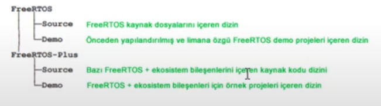
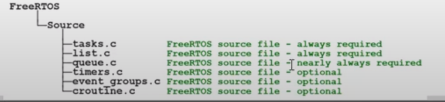
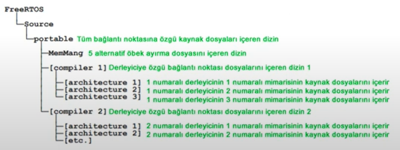
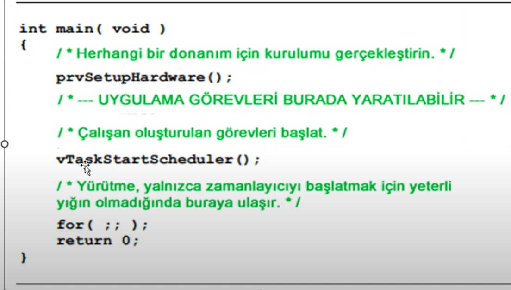
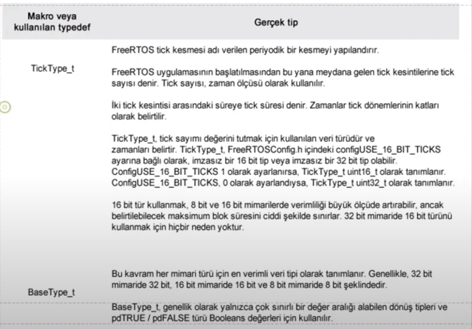
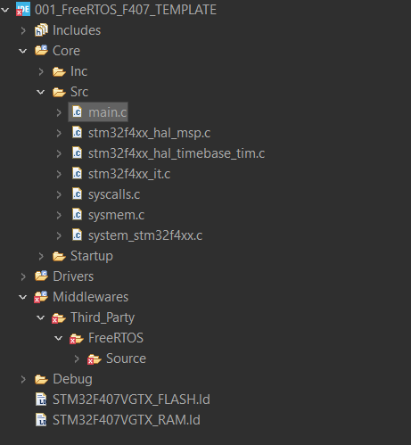
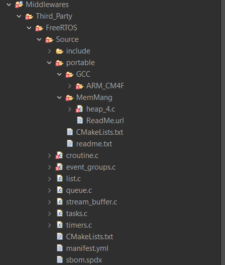

- FreeRTOS **multi-tasking** becelerini sağlayan bir kütüphane dizini olarak düşünebilir.

- FreeRTOS bir **API** olarak düşünebilir. MCU FreeRTOS'u bir işletim sistemi olarak kullanır.

- Ücretsizdir. **Header**'leri **include** ederek FreeRTOS'u kullanırız.

- **FreeRTOSConfig.h** -> Header dosyasında macrolarla konfigurasyon ayarlarını yaparız. Her macronun detayı için FreeRTOS'un websitesindeki dökümantasyon incelenmelidir. Bu dosya işletim sisteminin temel ayarlarının yapıldığı yerdir. **[FreeRTOSConfig.h](https://www.freertos.org/a00110.html)**. 

- Macroları aktif ederken mutlaka açıklaması iyice okunmalıdır. 

- FreeRTOS bir **API** olduğu için Proje dizinine klasörünü oluşturup, FreeRTOSConfig.h dosyasını ise projemizin include dizinine kopyalayıp **include** etmemiz gerekir.

- FreeRTOS bir zip dosyası olarak gelir. Bu zip dosyasında demolar,kaynak dosyaları bulunur.

;

- **FreeRTOS Plus** ek ekosistem bileşenleri içerir.

## FreeRTOS Kaynak Dosyaları
- Tüm Port(MCU'lar) için **ortak** bulunan 2 adet C dosyası bulunur.
    1. **task.c**
    2. **list.c**

- **queue.c** -> hem kuyruk hem semafor hizmeti sunar. Her zaman gereklidir
- **timers.c** -> Zamanlayıcı işlevi görür. Eğer zamanlayıcılar kullanılacaksa eklenir
- **events_groups.c** -> Olay gruplarına işlevsellik sağlar. Olay grupları kullanılacaksa eklenir.
- **croutine.c** -> FreeRTOS'a ortak rutin işlevselliği sağlar. Çok küçük mimarili işlemcilerde kullanılır. Dolayısıyla çok kullanılmamaktdır.

;

- FreeRTOS dosyalarının isimleri değiştirilmemelidir.

- FreeRTOS portable özelliği sağladığı için 1 MCU'dan diğer MCU'ya geçişi hızlandırıyor. Bu port etme işlemi için işlemciye özel dosyaları Portable Klasörü altında gruplarız

;

## FreeRTOS Stack Memory Management.
- FreeRTOS **5** farklı örnek dağıtım sunar
    1. heap_1.c
    2. heap_2.c
    3. heap_3.c
    4. heap_4.c
    5. heap_5.c

- Bu dosyalar FreeRTOS/Source/Portable/MemMang dizininde bulunurlar. Bu dosyalar içinden birisini seçip kullanırız.

- İlk olarak **FreeRTOS.h** ekleriz. Ayrıca **task.h**, **queue.h**, **semphr.h**, **timers.h**, **event_groups.h**;

- Demo uygulamaları Linuxta test edildiği için bazen hatalar oluşabilir. Ters slashlara dikkat etmek gerekir. Bir sorunda FreeRTOS sitesinden **contact** kısmını kullanabilirsin.

- Her demo uygulamaların ayrıca FreeRTOS sitesinde kendine ait sayfası mevcuttur.

- Kabaca bir Blinky FreeRTOS program body

;

## FreeRTOS Data Types and Coding Manual
- FreeRTOS'un her bağlantı noktası **TickType_t**, **BaseType_t** isimli veri tipleri içerir. Bu tanımlamalar **portmacro.h** içerisinde tanımlanır.

- Kodlama yaparken signed veya unsigned acikca belirtilmelidir. Düz **int** tipler asla kullanılmaz.

- Değişken isimleri degisken türlerine göre adlandırılır. Prefix şeklinde kullanılan değişkene eklenir.
    1. char -> **c**
    2. short(16-bit) -> **s**
    3. int32_t(32-bit) -> **l**
    4. Ve standart olmayan tüm tipler(structures, task handles, queue handles vs.) için **x** kullanılır.
    5. Bir değişken işaretsizse **u** ayrıca eklenir.
    6. Pointer icinse **p** eklenir.
    7. Void için **v** prefix olarak eklenir.
    8. Private içinse **prv** prefix olarak kullanılır.

- Macroların çoğu büyük harflerle tanımlanmıştır. 

## FreeRTOS Manual Integration to CUBEIDE
- Bu videoda anlatılıyor : https://www.youtube.com/watch?v=KKH0NjUYF_Y

- CubeMX üzerinden bir kod generasyonu yapıp, temel yapıyı generate etmesini sağlıyoruz. Timer1' i **Time Base source** olarak ayarlıyoruz. Daha başka birşey eklemeden kodumuzu generate ediyoruz.

- FreeRTOS websitesinden FreeRTOS'u indiririz. FreeRTOS'u zipten çıkarırız. CubeIDE projesinde Middlewares ve Third_Party klasörlerini oluşturuyoruz.(nested bir şekilde) Daha sonra indirdiğimiz FreeRTOS zip dosyasının içindeki source klasörünü olduğu gibi Third_Party'nin altına kopyalıyoruz. Aşağıdaki gibi bir dosya yapısı oluşmalıdır.

- Daha sonra **Source** klasörü içinde Portable klasörüne gidiyoruz. Burada **GCC** ve **MemMang** kalıcak şekilde diğer dosyaları siliyoruz. MemMang içinde heap_4 ve kullandığımız çekirdeğin derleyicisi kalıcak şekilde diğer dosyaları siliyoruz.

