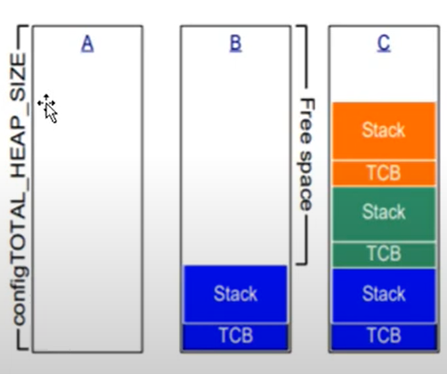

- FreeRTOS **multi-tasking** becelerini sağlayan bir kütüphane dizini olarak düşünebilir.

- FreeRTOS bir **API** olarak düşünebilir. MCU FreeRTOS'u bir işletim sistemi olarak kullanır.

- Ücretsizdir. **Header**'leri **include** ederek FreeRTOS'u kullanırız.

- **FreeRTOSConfig.h** -> Header dosyasında macrolarla konfigurasyon ayarlarını yaparız. Her macronun detayı için FreeRTOS'un websitesindeki dökümantasyon incelenmelidir. Bu dosya işletim sisteminin temel ayarlarının yapıldığı yerdir. **[FreeRTOSConfig.h](https://www.freertos.org/a00110.html)**. 

- Macroları aktif ederken mutlaka açıklaması iyice okunmalıdır. 

- FreeRTOS bir **API** olduğu için Proje dizinine klasörünü oluşturup, FreeRTOSConfig.h dosyasını ise projemizin include dizinine kopyalayıp **include** etmemiz gerekir.

- FreeRTOS bir zip dosyası olarak gelir. Bu zip dosyasında demolar,kaynak dosyaları bulunur.

;

- **FreeRTOS Plus** ek ekosistem bileşenleri içerir.

## FreeRTOS Kaynak Dosyaları
- Tüm Port(MCU'lar) için **ortak** bulunan 2 adet C dosyası bulunur.
    1. **task.c**
    2. **list.c**

- **queue.c** -> hem kuyruk hem semafor hizmeti sunar. Her zaman gereklidir
- **timers.c** -> Zamanlayıcı işlevi görür. Eğer zamanlayıcılar kullanılacaksa eklenir
- **events_groups.c** -> Olay gruplarına işlevsellik sağlar. Olay grupları kullanılacaksa eklenir.
- **croutine.c** -> FreeRTOS'a ortak rutin işlevselliği sağlar. Çok küçük mimarili işlemcilerde kullanılır. Dolayısıyla çok kullanılmamaktdır.

;

- FreeRTOS dosyalarının isimleri değiştirilmemelidir.

- FreeRTOS portable özelliği sağladığı için 1 MCU'dan diğer MCU'ya geçişi hızlandırıyor. Bu port etme işlemi için işlemciye özel dosyaları Portable Klasörü altında gruplarız

;

## FreeRTOS Stack Memory Management.
- FreeRTOS **5** farklı örnek dağıtım sunar
    1. heap_1.c
    2. heap_2.c
    3. heap_3.c
    4. heap_4.c
    5. heap_5.c

- Bu dosyalar FreeRTOS/Source/Portable/MemMang dizininde bulunurlar. Bu dosyalar içinden birisini seçip kullanırız.

- İlk olarak **FreeRTOS.h** ekleriz. Ayrıca **task.h**, **queue.h**, **semphr.h**, **timers.h**, **event_groups.h**;

- Demo uygulamaları Linuxta test edildiği için bazen hatalar oluşabilir. Ters slashlara dikkat etmek gerekir. Bir sorunda FreeRTOS sitesinden **contact** kısmını kullanabilirsin.

- Her demo uygulamaların ayrıca FreeRTOS sitesinde kendine ait sayfası mevcuttur.

- Kabaca bir Blinky FreeRTOS program body

;

## FreeRTOS Data Types and Coding Manual
- FreeRTOS'un her bağlantı noktası **TickType_t**, **BaseType_t** isimli veri tipleri içerir. Bu tanımlamalar **portmacro.h** içerisinde tanımlanır.


- Kodlama yaparken signed veya unsigned acikca belirtilmelidir. Düz **int** tipler asla kullanılmaz.

- Değişken isimleri degisken türlerine göre adlandırılır. Prefix şeklinde kullanılan değişkene eklenir.
    1. char -> **c**
    2. short(16-bit) -> **s**
    3. int32_t(32-bit) -> **l**
    4. Ve standart olmayan tüm tipler(structures, task handles, queue handles vs.) için **x** kullanılır.
    5. Bir değişken işaretsizse **u** ayrıca eklenir.
    6. Pointer icinse **p** eklenir.
    7. Void için **v** prefix olarak eklenir.
    8. Private içinse **prv** prefix olarak kullanılır.

- Macroların çoğu büyük harflerle tanımlanmıştır. 

## FreeRTOS Manual Integration to CUBEIDE
- Bu videoda anlatılıyor : https://www.youtube.com/watch?v=KKH0NjUYF_Y

- CubeMX üzerinden bir kod generasyonu yapıp, temel yapıyı generate etmesini sağlıyoruz. Timer1' i **Time Base source** olarak ayarlıyoruz. Daha başka birşey eklemeden kodumuzu generate ediyoruz.

- FreeRTOS websitesinden FreeRTOS'u indiririz. FreeRTOS'u zipten çıkarırız. CubeIDE projesinde Middlewares ve Third_Party klasörlerini oluşturuyoruz.(nested bir şekilde) Daha sonra indirdiğimiz FreeRTOS zip dosyasının içindeki source klasörünü olduğu gibi Third_Party'nin altına kopyalıyoruz. Aşağıdaki gibi bir dosya yapısı oluşmalıdır.


- Daha sonra **Source** klasörü içinde Portable klasörüne gidiyoruz. Burada **GCC** ve **MemMang** kalıcak şekilde diğer dosyaları siliyoruz. MemMang içinde heap_4 ve kullandığımız çekirdeğin derleyicisi kalıcak şekilde diğer dosyaları siliyoruz.


- Daha sonra Bu middleware klasörünün builde dahil edilmesini sağlamamız gerekiyor. Middleware klasörünün propertiesinden ve C\C++ build kısmından tikin kaldırılmış olduğuna emin oluyoruz.


- Bu aşamadan sonra build yapıyoruz. FreeRTOS.h missing hatası vericektir.

- **main.c** içerisindeki begin ve end markerlerini siliyoruz. Çünkü CubeMX'in kod generate özelliğini kullanmayacağız.


- Middleware -> Third_Party -> FreeRTOS -> Source -> include klasörünü olduğu gibi ekliyoruz. ayrica portable -> GCC -> çekirdeğin klasörünüde ekliyoruz

- Bu aşamada FreeRTOSConfig.h dosyasının olmadığını söyleyecektir. Bu dosyanın doğru yapılandırılması oldukça önemlidir. Demo projelerden çekirdeğe uygun olandan alıyoruz. Core-Inc klasörüne kopyalıyoruz. FreeRTOSConfig.h'ı oraya kopyaladık.

- stm32f4xx_it.c dosyasndaki Systick_Handler, PendSV_Handler, SVC_Handler fonksiyonlarını yorum satırı haline getiriyoruz. FreeRTOS Context switchingte bu fonksiyonları kullanır. Yani overwrite etmesine müsade etmemiz gerekir. 

- SystemCoreClock undeclared hatası vericek. FreeRTOSConfig.h içerisine bu satırı ekliyoruz


- Verdiği hataları çözmek için (IncrementTick ve Stackoverflow hataları) aşağıdaki satırlarla çözüyoruz. Bu satırların ne işe yaradığını FreeRTOS dökümantasyonundan kontrol edebiliriz.
``` C
#define configCHECK_FOR_STACK_OVERFLOW	0
#define configUSE_TICK_HOOK				0
```

- Bu aşamada 0 hatayla şablonumuzu oluşturmuş oluyoruz. FreeRTOSConfig.h her projenin özelleştirilmesini sağlar.

## FreeRTOS Ön-Bellek Yönetimi
- Ön bellek yönetimi için iyi bir **C** programlama bilgisi gerektirir.

- **Stack** ve **Heap** kavramlarının ne olduğu iyice bilinmelidir. Ayrıca **malloc()** ve **free()** fonksiyonlarını iyi bilmek gerekir. FreeRTOS'un kendine ait malloc ve free fonksiyonları mevcuttur

- Stack, heapın içerisinde oluşturulur. 

- FreeRTOS version 9'dan itibaren derleme zamanında **statik** ve run-time zamanında dinamik atamalar gerçekleştirilebilir.

- Yazılan programlarda 2 adet farklı zamanlarda atamalar mevcuttur. 
    1. Compiling Time
    2. Run Time

- Deadlock : Nested bir şekilde fonksiyonları iç içe çağırma sonucunda kilitlenme sorunu.

- FreeRTOS Tasklar için  hafızayı dinamik olarak arka planda yönetir.
 
- Standart C kütüphanesi(malloc ve free) **güvenilir** değil, **deterministik** değil, **Fragmentation** olabilir. **hata** ayıklamak zordur.

- FreeRTOS ilk sürümlerinde Compiling time'da bellek havuzları oluşturulup (farklı boyutlarda) daha sonra run timeda ihtiyaca göre o havuzlardan birisi çağrılıp kullanılırdı. 

- FreeRTOS'ta malloc() yerine **pvPortMalloc()** ve free() yerine **vPortFree()** kullanılır. Bu fonksiyonların tanımlamaları heap_1.c, heap_2.c, heap_3.c, heap_4.c, heap_5.c içerisinde yapılmıştır. İhtiyacımıza uygun olanı kullanırız veya modifiye ederiz.

### heap_1.c

- **heap_1.c** -> Küçük boyutlu RTOS için ve kerneli başlatmadan önce atamalarda kullanılır. Çekirdek nesnelerin oluşturulması(Tasklar,Queue) için kullanılır. Bu atama **free** edilemez. pvPortMalloc() oldukça primitive bir şekilde implemente edilmiştir. Bir görevi veya çekirdek nesnesini **hiçbir zaman** silmeyen uygulamalar için kullanılır.

- Kritik ve determistik çalışma gerektiren uygulamalarda kullanılır. pvPortMalloc() çağrıldıkça basit bir diziyi küçük boyutlara böler. Dizi FreeRTOS heapı olarak adlandırılır. Dizinin toplam boyutu(byte cinsinden) FreeRTOSConfig.h içinde aşağıdaki makroyla belirlenir.

``` C
#define configTOTAL_HEAP_SIZE (Dizinin Boyutu)
```



- Her oluşturulan task için, **TCB** -> Task Control Block ve Kendi Stackine ihtiyaç duyar. A -> FreeRTOS'a ayırdığımız RAM büyüklüğü.


### heap_2.c

- **heap_2.c** -> Yeni tasarımlar için kullanılması **önerilmez**. heap_2.c yerine heap_4.c kullanılması önerilir.

- Bellek ayırmak için en uygun algoritmayı kullanır ve **heap_1.c'den farklı olarak belleğin serbest kalmasına izin verir**.

- Heap dizisi yine statik olarak bildirilir, bu nedenle diziden herhangi bir bellek atanmadan önce bile uygulamanın **çok miktarda RAM** kullandığı görülür.

- pvPortMalloc() öğesinin istenen byte sayısına en yakın boyuttaki boş bellek kullanmasını sağlar. İhtiyaca göre heapı parçalayıp RAMi verimli kullanır. (Dolayısıyla Fragmentation yapar.)

- heap_4 ten farklı olarak bitişik serbest blockları daha büyük bir blokta birleştirmez. Dolayısıyla fragmentation'a daha duyarlıdır.

- Görevlere ayrılan **yığın boyutunun değişmediği** uygulamalarda elverişlidir.


- Tasklar için oluşturulan TCB ve Stack aynı boyutlu olmalıdır.

- heap_2.c deterministik **değildir**. Fakat standart C kütüphanesinden daha hızlıdır.

### heap_3.c

- **heap_3.c** -> Standart kütüphane **malloc()** ve **free()** işlemlerini kullanır. Dolayısıyla Heap boyutu **linker** yapılandırması tarafından tanımlanır. Dolayısıyla **configTOTAL_HEAP_SIZE** makrosunun hiçbir geçerliliği yoktur.

- FreeRTOS zamanlayıcısını **geçiçi** bir süre askıya alarak **malloc()** ve **free()**yi kullanır. Dolayısıyla atamalar güvenli olmuş olur

### heap_4.c
- **heap_4.c** : Çoğunlukla bu yapı kullanılır. **Dizi** daha küçük bloklara bölerek çalışır. Dizi **statik**olarak bildirilir.Aşağıdaki makroyla boyut ataması yapılır. Herhangi bir bellek ataması yapılmadan bile uygulama **çok miktarda RAM** kullanır

``` C
#define configTOTAL_HEAP_SIZE (bellek boyutu)
```

- heap_4.c, bitişik boş bellek bloklarını **büyük tek bir blok** şeklinde birleştirir ve bellek parçalanma(**fragmentation**) riskini en aza indirir.

- **First-Fit** algoritmasını kullanır. 

- Farklı boyutlardaki RAM bloklarını **tekrar tekrar** tahsis eden ve serbest bırakan uygulamalar için uygundur.


- heap_4 deterministik **değildir**, ancak **malloc()** ve **free()**

- Bazen bir uygulama için heap_4 tarafından kullanılan diziyi belirli bir hafıza adresine yerleştirmek gerekir. Mesela Hızlı bir bellek bölgesine yerleştirilebilir. Normalde linker otomatik bir şekilde ayarlar. FreeRTOSConfig.h dosyasında aşağıdaki makroyu 1 yaparsak uygulama tarafından bildirilmesi gerekir.

``` C
#define configAPPLICATION_ALLOCATED_HEAP 1
```

- Eğer yukardaki makro 1 olarak ayarlandıysaa ucHeap adlı ve configTOTAL_HEAP_SIZE ayarıyla boyutlandırılmış bir uint8_t dizisi uygulamanın kaynak dosyasında bildirilmelidir. Bu ayarlar compiler-dependenttir.

- Örnek olarak <code>uint8_t ucHeap[configTOTAL_HEAP_SIZE] __attribute__ ((section(.my_heap)));</code> şeklinde kullanılabilir.


### heap_5.c
- **heap_5.c** tarafından kullanılan bellek ayırmak ve boş hafıza ayırma algoritması heap_4.c ile aynıdır. Farklı olarak heap_5.c, statik olarak bildirilen **tek bir diziden bellek ayırmakla sınırlı değildir**. Birden fazla ve ayrılmış hafıza alanlarından hafıza ayırabilir.

- FreeRTOS'un çalıştığı sistem tarafından sağlanan RAM, sistemin bellek haritasında tek bir bitişik blok olarak görünmediğinden oldukça kullanışlıdır.

- **pvPortMalloc()** kullanılmadan önce **vPortDefineHeapRegions()** çağrılarak bellek ataması yapılır. Ayrıca herhangi çekirden nesnesi(tasks, queues, semaphore) oluşturulmadan önce **vPortDefineHeapRegions()** çağrılmalıdır.

- <code> void vPortDefineHeapRegions(const HeapRegion_t* const pxHeapRegions); </code> fonksiyonun protatipi. Başlagıç adresi ve boyutunu fonksiyona veririz.


- Her bir ayrı bellek alanı, **HeapRegion_t** tipinde bir yapı ile tanımlanmaktadır. Kullanılabilir tüm bellek alanları, HeapRegion_t yapılarının dizisi olarak **vPortDefineHeapRegions()** öğesine iletilir 


- **xPortGetFreeHeapSize()** fonksiyonu heaptaki boş bay sayısını döndürür.  Heap boyutunu optimize etmek için kullanılabilir.

- **xPortGetMinimumEverFreeHeapSize()** -> Uygulama başladığından beri yığında mevcut olan minimum ayrılmamış byte sayısını döndürür. Maksimum ne kadar boş alan kaldığını görüp overflow durumlarını görmemiz ve hafıza yönetimini daha iyi yapabiliriz.

- Malloc Başarısız Hook işlemleri : Malloc başarısız olduğunda, yani **NULL** döndürdüğünde RAM ataması yapılmamış olduğunu gösterir. Aşağıdaki makro 1 ayarlanmışsa, uygulama bir başarısız malloc sonucunda çağrılacak bir hook işlemi sağlamalıdır(bir çeşit callback işlemi veya error handling işlemi.)

``` C
#define configUSE_MALLOC_FAILED_USE 1
```