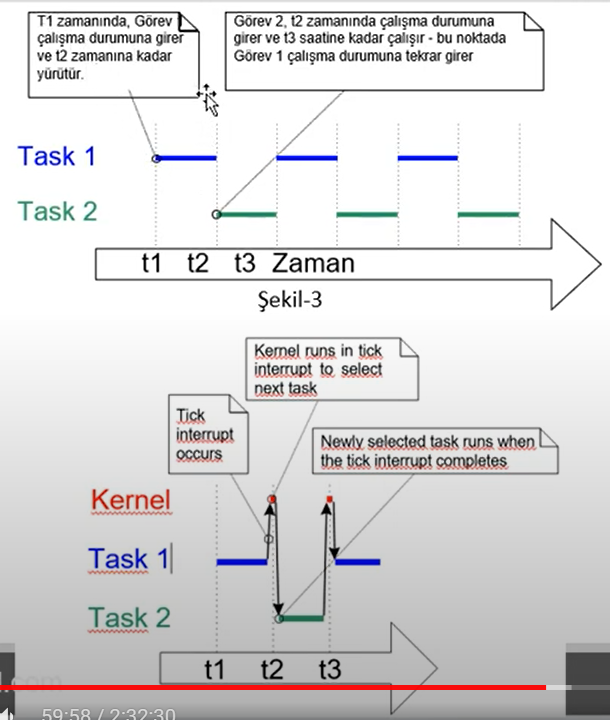

### FreeRTOS Task Management
- C fonksiyonları olarak tasklar tanımlanır. **void** fonksiyon olarak ve bir **void pointer parametresi** olarak alan bir fonksiyondur.

- Aslında her görev kendi başına küçük bir programdır. Tasklarda kullanılacak değişkenleri global olarak tanımlamıyoruz. Görev normalde sonsuz bir döngü içinde sonsuza dek çalışır. <code> void aTaskFunction(void * pvParameters) </code> gibi tanımlanabilir.

- FreeRTOS görevlerinin uygulama fonksiyonlarından hiçbir şekilde **return**'a izin verilmemelidir. Görev gerekli değilse silinmesi gerekir.

- Herhangi sayıda görev oluşturmak için tek bir görev kullanılabilir.

- Bir uygulama birçok görevden oluşur. 

- Uygulamayı çalıştıran işlemci tek çekirdekliyse, **aynı anda sadece** 1 görev yürütebilir

- Bir görev aynı anda sadece ya **çalışmakta** ya da **çalışmamakta** olabilir.


- FreeRTOS zamanlayıcısı(**scheduler**), bir görevin durumunu değiştirilebilen **tek** unsurdur.

#### Görev Oluşturma
- xTaskCreate fonksiyonuyla oluştururuz.

``` C
BaseType_t xTaskCreate(TaskFunction_t pvTaskCode, const char * const pcName, uint16_t usStackDepth, void * pvParameters, UBaseType_t uxPriority, TaskHandle_t * pxCreatedTask);
```
- **pvTaskCode**  : Görevi uygulayan fonksiyona ait pointer, Yani fonksiyonun adıdır.

- **pcName** : Görev için açıklayıcı addır. FreeRTOS tarafından kullanılmaz. Sadece Debugta yardımcı olması için kullanılır. Alabileceği maximum uzunluk FreeRTOSConfig.h içerisindeki <code>configMax_TASK_NAME_LEN</code> ile (null sonlandırıcı dahil) belirlenir.

- **usStackDepth** : Byte cinsiden stack belleğin büyüklüğünü belirtir.Idle task için kullanılan yığın boyutu <code>configMINIMAL_STACK_SIZE</code> tarafından tanımlanır

- **pvParameters** : Görev fonksiyonları, void (void *) için pointer parameterler alarak göreve iletilen değerlerdir.

- **uxPriority** : Görevin önceliğini belirtir. (0 ve <code>configMAX_PRIORITIES - 1</code>) arasında değer alır.

- **pxCreatedTask** : Oluşturan göreve bir handle tanımlamak için kullanılır. Daha sonra bu handle vasıtasıyla göreve erişmek amacında kullanılır.

- **return değerleri** : pdPASS -> Başarıyla oluşturma, pdFAIL -> Yeterli bellek bulunmadığı için görevin oluşturulamadığını gösterir.


- cmsisos -> RTOS kullanımını kolaylaştırmak için yazılmış bir ara katmandır.  ST firması arayüzü kolaylaştırmak için bu katmanı yazmıştır. 

- Sonsuz for dongusu veya while dongusuyle delaylar yapmak iyi degil.

- Görev içerisinde görev de oluşturabiliriz. Taskın işi bittikten sonra silmemiz gerekir.

- Bir task başlatıldıktan sonra **vTaskPrioritySet()** fonksiyonu kullanılarak önceliği değiştirilebilir.

- Mevcut maksimum öncelik sayısı, **FreeRTOSConfig.h** içinde tanımlı <code>configMAX_PRIORITIES</code> compiling-time makrosuyla belirlenir. Bir taskın alabileceği priority seviyesi 0 ile <code>configMAX_PRIORITIES</code> - 1 arasındadır.

- FreeRTOS zamanlayıcısı, hangi görevin çalışacağına karar verirken 2 yöntem kullanır. 
    1. **Genel Yöntem** -> Tüm FreeRTOS portlarında kullanılabilir. configMax alabileceği değeri sınırlamaz. Çünkü Priority arttıkça RAM tüketimi artar. FreeRTOSConfig.h içerisinde <code>configUSE_PORT_OPTIMISED_TASK_SELECTION 0</code> olarak ayarlanırsa veya tanımsız bırakılırsa genel yöntem kullanılır.

    2. **Mimari Optimize edilmiş Yöntem** -> Az miktarda assembler kodu kullanır ve genel yöntemden daha hızlıdır.<code>configMax_PRIORITIES</code> 32'den büyük olamaz. Olabildiğince minimumda tutulması önerilir çünkü ne kadar yüksek olursa o kadar fazla RAM tüketir. <code>configUSE_PORT_OPTIMISED_TASK_SELECTION 1</code> olarak ayarlanırsa mimari optimizasyon yöntemi kullanılır. Tüm portlar mimari optimize yöntem sunmayabilir.

#### Zaman Ölçümü ve Zaman Tik Kesmesi
- Zaman Tik kesmesi **periyodik** olan bir kesmedir. Scheduler kesme esnasında context switching işlemini yaapar.



- FreeRTOSConfig.h içerisinde tanımlı <code>configTICK_RATE_HZ</code> ile compiling-time esnasında belirlir. Buradaki değer ile tick periyot zamanı belirlenir. 

- Zamanlayıcı Tick Kesme dışında da context switching yapabilir. Ayrıca Yürütülen bir görev **Blocked** duruma girerse veya Yüksek öncelikli bir görev **Ready** duruma girdiğinde de derhal yürütülecek görevi seçer. 

- <code>pdMS_TO_TICKS()</code> makrosu milisaniye cinsinden belirtilen bir zamanı tiklere çevirir. 1LHZ üzerindeyse kullanılmaz.
- Örnek : 200 milisaniyenin kaç tick olacağını hesaplamak için <code>TickType_t xTimeInTicks = pdMS_TO_TICKS(200);</code>

- Ayrıca tick count, zamanlayıcının başlatılmasından bu yana gerçekleşen toplam tik kesmesi sayısıdır. Taşma olmadığı varsayılır. 

- **Zamanlayıcı her zaman çalıştırılabilen en yüksek öncelikli görevi seçer**.


- Görevler iki farklı olay türünü beklemek için engellenen(**blocked**) duruma girebilir. 
    1. **Geçiçi Zaman** : Belli bir süre bekleme durumu.
    2. **Senkronizasyon olayları** : Semaforlar, mutexler gibi senkronizasyon olayları için blocked statete olma durumu

- Askıya alınmış(Suspended) durumu süresiz, (tekrar çağrılana kadar) engellenme durumudur. Bu duruma <code>vTaskSuspend()</code> ile girilir. <code>vTaskResume()</code> veya <code>xTaskResumeFromISR()</code> ile çıkılır. Çoğu uygulamada kullanılmaz.

- Ready State : Çalışmaya hazır fakat CPU' da koşmuyordur.


- Polling formu verimsiz ve dezavantajları mevcuttur. Görev gerçekte bir iş yapmadığı gibi CPU zamanını da meşgul eder. <code>void vTaskDelay(TickType_t xTicksToDelay)</code> ile bu davranış giderilebilir. Bu fonksiyon kendisini çağıran fonksiyonu xTicksToDelay kadar suspended state durumuna alır.

- <code>vTaskDelay</code> ancak FreeRTOSConfig.h içerisinde <code>INCLUDE_vTaskDelay 1</code> olarak ayarladığı zaman kullanılabilir.Fonksiyonun aldığı parametrenin tick cinsinden olduğu unutulmamalıdır.

- Örneğin, 100 ms beklemek için <code>vTaskDelay(pdMS_TO_TICKS(100))</code> ile yapılabilir.

- **vTaskDelayUntil()** : Belirli bir ticke kadar beklemek için kullanılır. Mesela 100cu tikte aktif ol diyebiliriz. Periyodik zamanlamalar yapılacağı zaman kullanılır. 2 adet parametre alır
    1. **pxPreviousWakeTime** : En son çalıştığı zamanı belirtir.Referans noktası olarak kullanılır.
    2. **xTimeIncrement** : Ne kadar tick sonra tekrar ready state geçmesi için kullanılır. Yani bir sonraki uyanma zamanı : pxPreviousWakeTime + xTimeIncrement şeklindedir.

- Sabit frekansta çağrılmasını istediğimiz zaman **vTaskDelayUntil** ile yaparız.

- vTaskDelay'de ise uyumasını istediğimiz süresi söyleriz. vTaskDelayUntilde ise ne zaman uyanmasını istediğimizi söyleriz.

#### Idle Task and Idle Task Hook
- Her zaman **Run** konumuna geçebilecek en az 1 görev olmalıdır. **vTaskStartScheduler()** çağrıldığında Idle task oluşturur ve boş kaldıkça sürekli onu çağırır. Boşta görev her zaman **en düşük** önceliğe sahiptir.FreeRTOSConfig.h içerisindeki <code>ConfigIDLE_SHOULD_YIELD</code> zaman yapılandırma sabiti derlenir.

- En düşük öncelikte çalışmak, daha yüksek öncelikli bir görev Ready durumuna girer girmez IdleTask'ın çalışma durumundan çıkarılmasını sağlar.

- **IdleTask** çalışıyorken yada çalışmak üzereyken <code>vTaskDelete()</code> kullanmamalıyız. Çünkü bir task silindiği zaman IdleTask çekirdekteki temizliği sağlar. IdleTask bir nevi Garbage collector gibi kullanılır.

- **Idle Task Hook** : Bu fonksiyon boşta görevi tarafından her bir iterasyonda bir kez otomatik olarak çağrılan bir işlevdir. Yani idle olarak ne kadar zaman geçirdiğimizi hesaplamamıza yardımcı olur. Syntax : <code>void vApplicationIdleHook(void);</code>


#### ITM(Instrumentation Trace Macrocell) ile printf() kullanımı
- ITM, Arm-Cortex Mx serisi çekirdeklerin çevre birimlerinden birisidir.
- Aşağıda verilen kodu proje dosyasındaki <code>Core/Src/syscall.c</code> içine kopyalıyoruz

``` C
/*  Implementation of printf like feature using Cortex M3-M4/ ITM Functionality
    This function will not work for ARM Cortex M0/M0+
*/
//Debug Exception and Monitor Control Register base address
#define DEMCR                   *((volatile uint32_t *) 0xE000EDFCU)
/* ITM Register addresses */
#define ITM_STIMULUS_PORT0      *((volatile uint32_t *) 0xE00000000)
#define ITM_TRACE_EN            *((volatile uint32_t *) 0xE00000E00)

void ITM_SendChar(uint8_t ch)
{
    // Enable TRCENA
    DEMCR |= (1 << 24);
    // enable stimulus port 0
    ITM_TRACE_EN |= (1 << 0);

    // read FIFO status in bit [0]
    while(!(ITM_STUMULUS_PORT0 & 1));

    //Write to ITM stimulus port0
    ITM_STIMULUS_PORT0 = ch;

}
```
- Daha sonra aynı dosyada 136. satırda yer alan _write fonksiyonu içerisini aşağıdaki gibi düzenliyoruz

``` C
__attribute__((weak)) int __write(int file, char *ptr, int len)
{
    int DataIdx;
    for(DataIdx = 0; DataIdx < len; DataIdx++)
    {
        //__io_putchar(*ptr++)
        ITM_SendChar(*ptr++);
    }
    return len; 
}
```

- Scheduler başlatıldıktan sonra Taskın önceliğini değiştirmeyi <code>vTaskPrioritySet()</code> ile yapabiliriz.FreeRTOSConfig.h içerisinde <code>#define INCLUDE_vTaskPrioritySet 1</code> olarak ayarlanmalıdır.
    1. **pxTask** : Bu parametre prioritysi değiştirilecek taskın handle'i
    2. **uxNewPriority** : Atanması istenen öncelik. 0 ve configMAX_PRIORITIES -1 değerleri arasında olmalı.

- Fonksiyonun protitipi : <code>UBaseType_t uxTaskPriorityGet(TaskHandle_t pxTask);</code>

- Ayrıca bir taskın mevcut prioritysini sorgulamak için <code>uxTaskPriorityGet()</code> ile yapabiliriz. FreeRTOSConfig. içerisinde <code>#define INCLUDE_uxTaskPriorityGet 1</code> olarak tanımlanmış olması önkoşuldur.

- **vTaskDelete()** : Bir task, kendisini veya başka bir görevi silmek için kullanılır. Bunu kullanmak için **FreeRTOSConfig.h** içerisindeki <code>#define INCLUDE_vTaskDelete 1</code> olarak ayarlanmalıdır. Silinmiş olan görevlere ait belleği temizlemek **IdleTask**'ın işidir. 

#### Görev durumları
- Bir görev çalışıyor veya çalışmıyor durumda olabilir. Tek çekirdekli bir işlemcide, çalışan durumda olan sadece 1 görev olabilir.
- FreeRTOSConfig.h içerisinde <code>#define configUSE_PREEMPTION ve #define configUSE_TIME_SLICING</code> makrolarıyla hangi algoritmayı kullanacağımızı seçiyoruz.