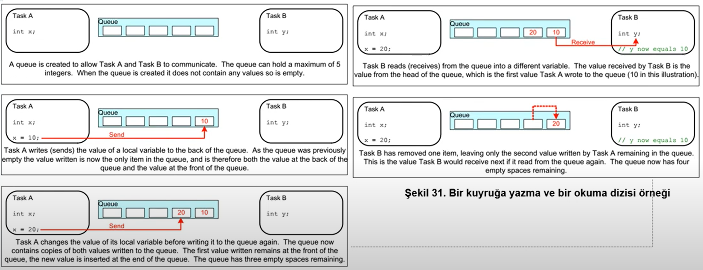
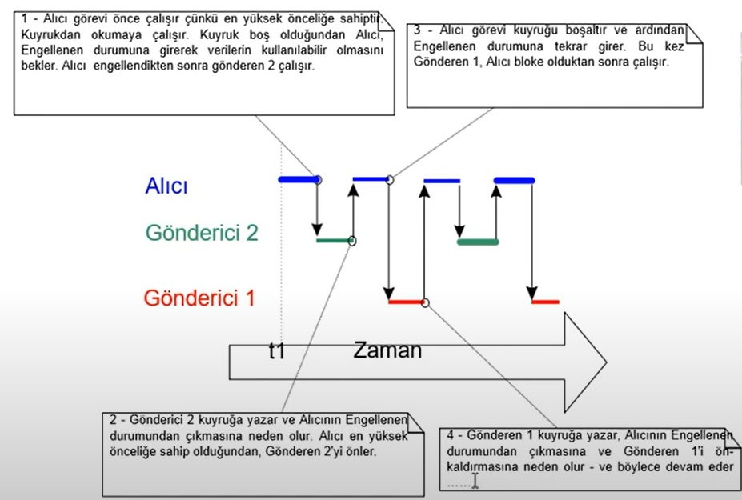
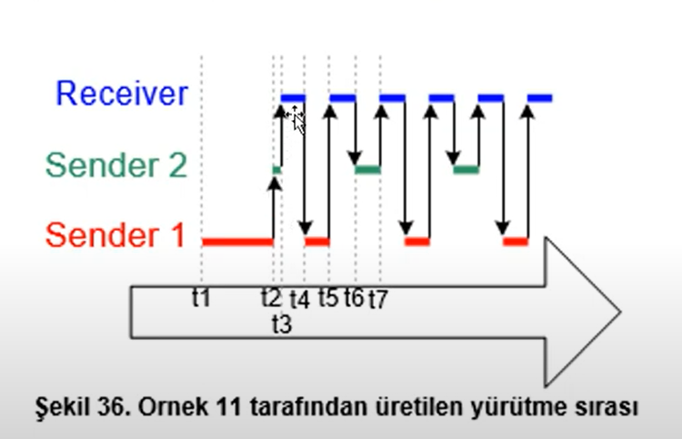
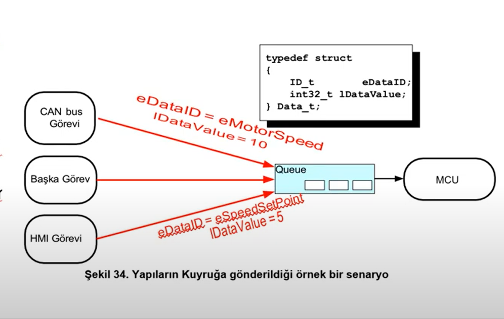

# **QUEUE MANAGEMENT**
- Geleneksel programcılığın dezavantajlarından birisi race-condition. Karmaşıklık arttıkça global değişkenler problemler çıkartır. Dolayısıyla RTOS sistemlerde Queue oluşturulup bu amaçla kullanılır. 
- RTOS felsefesinde Global değişkenler **kullanılmaz**. İşler Queue ile halledilir. Queue sağlıklı veri aktarımını sağlar. Ayrıca ISR'lar içerisinde normal fonksiyonları çağırmıyoruz. ISR fonksiyonlarını kullanıyoruz. ISR fonksiyonlarının öncelliği daha yüksetir.

- **Queue** : Sınırlı sayıda sabit boyutlu bir veri öğesi tutar. Maximum uzunluğu vardır. FIFO (First-in, First-Out) yapısını kullanır. Veri tipi ve uzunluğunu belirttiğimiz bir dizi oluştururuz. Queue Managment içeride Queuenin shift edilmesini sağlar



- Queue'ye eleman eklemenin 2 farklı yöntemi vardır.
    1. Kopyalayarak kuyruğa alma
    2. Referansa göre kuyruğa alma(pointer)

- **FreeRTOS** kuyruğa kopya yöntemini kullanır. Bu yapıya ayrıca ring-buffer yada pipe-line'de denir.

- Queue'lara birden fazla okuyan veya yazan olabilir.

- Kuyruktan bir veri okumak isteyen bir görev, eğer kuyruk boş ise **engellenmiş** duruma alınır ve kuyruğa yeni bir item eklenene kadar bekler. Fakat kuyruğa bir item eklendiğinde otomatik olarak hazır duruma geçer. Eğer bir kuyruğu bekleyen **birden** fazla görev var ise ve öncelikleri eşitse, en uzun süre bekleyen görevin engeli kaldırılıp kuyruğa erişmesi sağlanır.
 
- Kuyruk doluyken kuyruğa yazmayı bekleyen bir görevde engellenir. Ve bir zaman sınırı verilip bekletilir.

- **xQueuecreate()** ile queue oluşturmak için kullanılır. QueueHandle_t türünde bir handle ile tanıtılır. Eğer yeterli RAM yoksa **NULL** döndürür.

- **Prototip** : <code>QueueHandle_t xQueueCreate(UBaseType_t uxQueueLength, UBaseType_t uxItemSize);</code>
    1. **uxQueueLength** : Oluşturulan kuyruğun maximum öğe sayısı
    2. **uxItemSize** : Oluşturulan kuyruğun byte cinsinden büyüklüğü(uint8_t, uint16_t gibi)
    3. **return value** : kuyruk oluşmadıysa NULL döndürür.


- **xQueueReset()** : kuyruğu tamamen boş hale çeviren fonksiyon.


- **xQueueSendToBack()** : Kuyruğun arkasına yazmak için kullanılır. ISR içinden çağrılmamalıdır. Bunun yerine <code>xQueueSendToBackFromISR()</code> kullanılır. Ayrıca ISR fonksiyonlarının öncelliği daha yüksetir.
- Prototip : <code>BaseType_t xQueueSendToBack(QueueHandle_t xQueue, const void * pvItemToQueue, TickType_t xTicksToWait);</code>


- **xQueueSendToFront()** : Kuyruğun başına yazmak için kullanılır. ISR içinden çağrılmamalıdır. Bunun yerine <code>xQueueSendToFrontFromISR()</code> kullanılır.Ayrıca ISR fonksiyonlarının öncelliği daha yüksetir.
- Prototip : <code>BaseType_t xQueueSendToFront(QueueHandle_t xQueue, const void * pvItemToQueue, TickType_t xTicksToWait);</code>

- Queue oluştururken, veri tipini tanımlıyoruz fakat veri gönderirken void pointer olarak gönderiyoruz. Bunun sebebi hepsini kapsayan bir şekilde yazılmış olsun diye bu şekilde tanımlamışlar.

- Parametreler :
    1. **pvItemToQueue** : Kuyruğa eklemek istediğimiz item.
    2. **xTicksToWait** : Eğer kuyruk doluysa beklemek istediğimiz sürenin Tick cinsinden değeri. (<code>pdMS_TO_TICKS()</code>). Ayrıca sonsuza kadar beklemek için <code>portMAX_DELAY</code> kullanabiliriz fakat bunun ön koşulu da FreeRTOSConfig.h içerisinde
    aşağıdaki tanımlamanın yapılmış olması gerekmektedir.
    ``` C
    #define INCLUDE_vTaskSuspend 1
    ```


- **xQueueReceive()** : Kuyruktan bir öğeyi almak için kullanılır.ISR içinden çağrılmamalıdır. Bunun yerine <code>xQueueReceiveFromISR()</code> kullanılmalıdır.
- Prototip : <code>BaseType_t xQueueReceive(QueueHandle_t xQueue, void *const pvBuffer, TickType_t xTicksToWait);</code>
- Parametreler
    1. **xQueue** : Verilerin alındığı kuyruk instance'si. 
    2. **pvBuffer** : Kuyruktan alınan veri öğesinin kopyalanacağı yer.
    3. **xTicksToWait** : Eğer kuyruk doluysa beklemek istediğimiz sürenin Tick cinsinden değeri.


- **uxQueueMessagesWaiting()** : Kuyrukta bulunan öğe sayısını sorgulamak için kullanılır.ISR içinden çağrılmamalıdır. Bunun yerine <code>xQueueMessagesWaitingFromISR()</code> kullanılmalıdır.
- Prototip : <code>UBaseType_t uxQueueMessagesWaiting(QueueHandle_t xQueue);</code>

- Alıcının yüksek öncelikli olduğu durum



- Alıcının daha düşük öncelikli olduğu durum




- Çoklu senderin olduğu yapılarda veriyi bir paket şeklinde(typedef) ile göndererek hem veriyi, hemde gönderici belirtecek şekilde göndeririz. Dolayısıyla alıcı gereken aksiyonları almasında avantaj sağlar.




- **Büyük** ve **Değişken** boyutlu data ile çalışıldığında Queue'a veriyi kopyalamak yerine **pointer**ler verilir. Fakat bazı durumlara dikkat edilmelidir.
    1. İşaret edilen RAM'in sahibi **açıkça** tanımlanmalıdır.(Aynı anda farklı görevler tarafından değiştirmeyi önlemek için). Bu duruma **mutual exclusion**(karşılıklı dışlama) denir.
    2. Belirtilen RAM bölgesi geçerli kalır. Eğer dinamik olarak atanmış bir hafızaysa, onun sonrasında temizlenmesinden bir task sorumlu olmalıdır.

- **Queue Kümeleri** : Bir görev birden fazla kuyruktan veri almasına izin verir. <code>xQueueCreateSet()</code> kuyruk kümesi oluşturabiliriz. Çok verimli olmadığı için pek önerilmez. 

- **xQueueCreateSet()** : Kuyruk kümesi oluşturan fonksiyon. Bunu kullanmak için aşağıdaki makro FreeRTOSConfig.h içerisinde tanımlanmış olmalıdır
``` C
#define configUSE_QUEUE_SETS 1
```
- Prototip : <code>QueueSetHandle_t xQueueCreateSet(const UBaseType_t uxEventQueueLength);</code>
- Parametreler 
    1. **uxEventQueueLength** : Maksimum tutulacak kuyruk sayısının uzunluğu. 

- Queue yapısını bir posta kutusu olarakta kullanabiliriz. Genelde bir görevden, yada bir ISR'dan bir göreve veri aktarmak için kullanılır. Mailbox yapısında olan Queue'lar sadece **1** elemanlıdır.