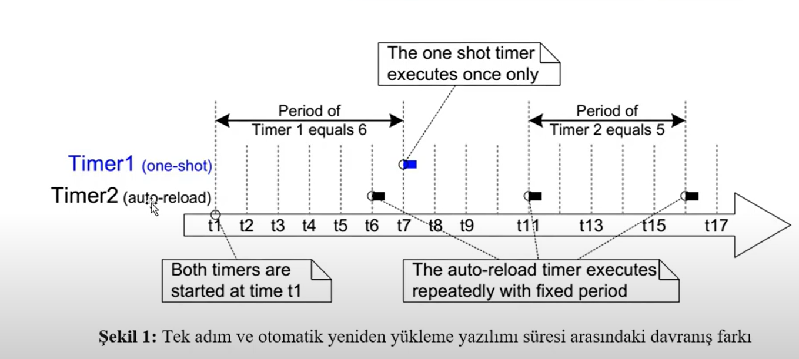
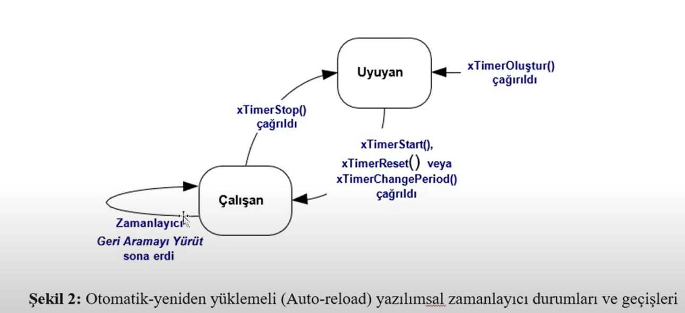

# **TIME MANAGEMENT**
- Software timers, bir işlevin gelecekte belli sabit bir frekansta yürütülmesini zamanlamak için kullanılır. Bu timerler yazilimsal oldukları için donanım desteği **gerektirmezler**. CallBack fonksiyonu kullanılmadığı sürece time slicetan herhangi bir tick işgal etmez.

- **FreeRTOS/Source/timers.c** dosyası projeye eklenir. FreeRTOSConfig.h dosyası içersine aşağıdaki makro eklenir
``` C
#define configUSE_TIMERS 1
```
- CallBack Fonksiyon Prototip : <code>void ATimerCallback(TimerHandle_t xTimer);</code>.
- CallBack fonksiyonu kısa tutulmalı ve engellenen duruma girmemelidir.

- Software timerler **Tek-seferlik** ve **Otomatik yeniden yüklemeli** zamanlıyıclar olarak 2 gruba ayrılır.
    1. Tek-Seferlik : Yanlızca callback fonksiyonu 1 kez çağrılır. Manual olarak tekrar başlatılabilir.
    2. Otomatik yeniden yüklemeli : Süresi dolduğunda kendi kendini yeniden başlatır.



- Software Timerlar Uyuyan ve Çalışan durumda bulunabilir
    1. Hareketsiz : Callback fonksiyonunu çağırmaz
    3. Çalışan : Callback fonksiyonunu çağırır.



- RTOS Deamon görev arka planda yöneten görevdir. Aşağıdaki makrolarla bu görevin önceliği ve stack boyutu belirlenir. Ayrıca zamanlayıcı kuyruk uzunluğuda bulunur.
``` C
#define configTIMER_TASK_PRIORITY 2
#define configTIMER_QUEUE_LENGTH 10
#define configTIMER_TASK_STACK_DEPTH 256
```

- **xTimerCreate()** : Bir timer oluşturmak için kullanılan görev.
- Prototip : <code>TimerHandle_t xTimerCreate(const char * const pcTimerName, TickType_t xTimerPeriodInTicks, UBaseType_t uxAutoReload, void * pvTimerID, TimerCallbackFunction_t pxCallbackFunction);</code>

- Parametreler : 
    1. **pcTimerName** : açıklayıcı ad. FreeRTOS tarafından kullanılmaz. Sadece debug yaparken işimizi kolaylaştırır.
    2. **xTimerPeriodInTicks** : Tick cinsiden timerin periyodu. <code>pdMS_TO_TICKS()</code> makrosu kullanılabilir
    3. **uxAutoReload** : Otomatik yükleme yapılacağını belirtir. <code>pdTRUE</code> -> Auto-Reload, <code>pdFALSE</code> Single-Shot
    4. **pvTimerID** : Timerin Kimliği
    5. **pxCallbackFunction** : Callback durumunda çağrılacak fonksiyon
    6. **return value** : NULL dönürse timer oluşturulamamıştır.

- **xTimerStart()** : Uyuyan durumdaki bir timeri başlatmak için kullanılır. Bu fonksiyon ISR'dan çağrılmamalıdır. Bunun yerine <code>xTimerStartFromISR()</code> kullanılmalıdır.
- Prototip : <code>BaseType_t xTimerStart(TimerHandle_t xTimer, TickType_t xTicksToWait)</code>

- **xTimerStop()** : Çalışan durumdaki bir timeri durduramak için kullanılır. Bu fonksiyon ISR'dan kullanılmamalıdır.Bunun yerine <code>xTimerStopFromISR()</code> kullanılmalıdır.

- **pvTimerGetTimerID()** ile timerin Id'sini alabiliriz. Prototip : <code>void *pvTimerGetTimerID(TimerHandle_t xTimer);</code>

- Aynı Callback fonksiyonu birden fazla timer tarafından kullanılabilir.

- **xTimerChangePeriod()** ile Software timerin periyodu değiştirilebilir.
- Prototip : <code>BaseType_t xTimerChangePeriod(TimerHandle_t xTimer, TickType_t xNewTimerPeriodInTicks, TickType_t xTicksToWait);</code>

- Timeri resetlediğimizde baştan saymaya başlar.