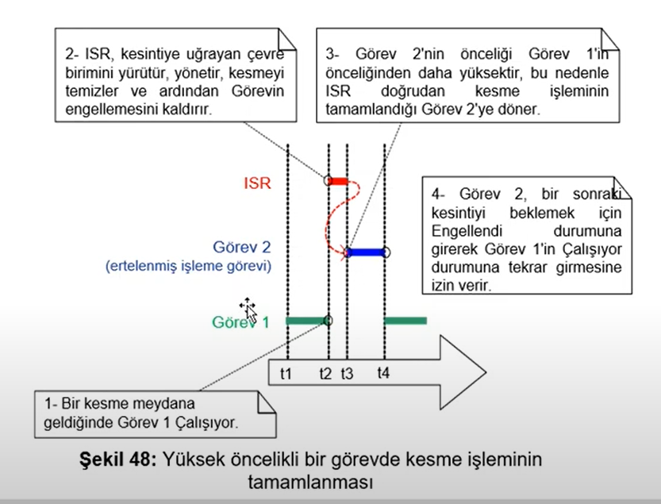
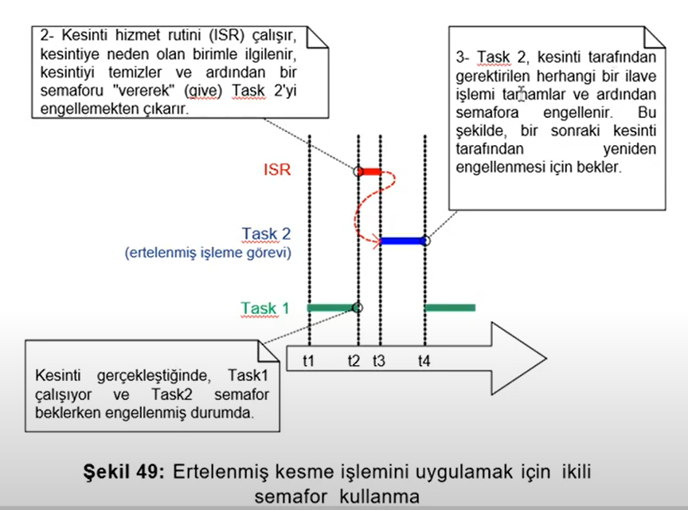
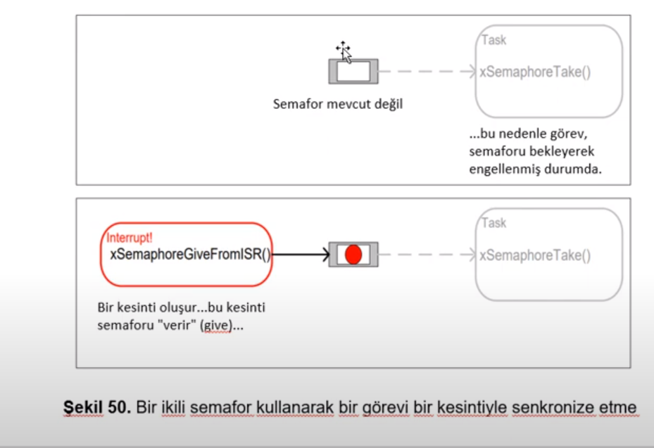
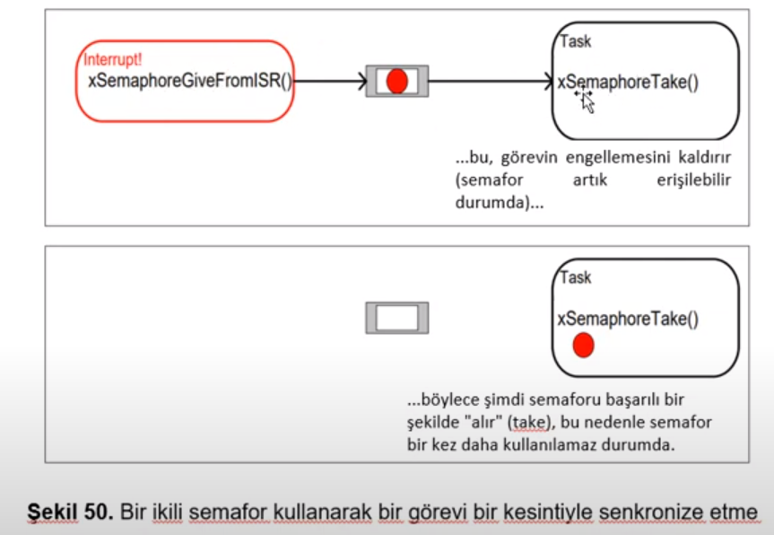

# **ISR MANAGEMENT** 

- ISR yönetimini doğru bir strateji çerçevesinde yapılmalıdır. ISR içindeki işlemler olabildiğince **minimum** seviyede tutulmalıdır. Öncelikler doğru bir şekilde ayarlanmalıdır. Hardware Interrupt **en yüksek öncelikli** tasktan önceliklidir.
- **Asla** adında <code>FromISR</code> bulunmayan bir fonksiyonu kesmede kullanmayınız.
- Interrupt routinin içerisinde veriyi bir data yapısıyla goreve iletip görevde process etmek daha iyidir.  

``` C
#define configUSE_PREEMPTION 1
```
- makrosu tanımlanarak görevler arasında yüksek öncelikli görev ready haline geldiyse ona geçmesini sağlar.

- Eğer ISR içerisinde daha yüksek öncelikli bir görevi çağırdıysak, <code>*pxHigherPriorityTaskWoken = pdTRUE</code> yapmamız lazım.Eğer bunu set etmezsek bir sonraki tick interrupt olayina kadar ready State'te kalır.
- Ayrıca  <code>*pxHigherPriorityTaskWoken</code> ilk defa kullanılmadan önce pdFALSE' eşitlenmelidir.

## Context Switching Macros
- **taskYIELD()** : Bir context-switching istemek için bir görev içerisinde çağrılabilen makrodur
- **portYIELD_FROM_ISR()** ve **portEND_SWITCHING_ISR()** -> **taskYIELD()** in güvenli versiyonlarıdır. ikisi aynı gorevi yapar. Fakat biz **portYIELD_FROM_ISR()** kullanacaz.
- Prototip : <code>portYIELD_FROM_ISR(xHigherPriorityTaskWoken)</code>.

- Eğer <code>xHigherPriorityTaskWoken</code> parametresi **pdFALSE** ise context-switching istemez ve makronun hiçbir etkisi olmaz. Bu makroların herhangi bir ISR içinden çağrılmasına izin verilir. Bazı küçük mimarilerde ISR rutinin sonunda çağrılmasına izin verilir.

## Ertelenmiş Kesme İşlemleri
- ISR'ları mümkün olduğunca kısa tutmak gerekir. ISR'lar bir görevin çalışma ve yürütme zamanını bozabilir(Jitter ekleyebilir). ISR anında erişilen değişkenler, çevre birimlerini kontrol ederken dikkatli olmak gerekir.
- Olabildiğince Nested Interruptlardan uzak durulması tavsiye edilir. ISR rutini kesmeyi hızlıca tamamlayıp asıl işi bir task içerisinde yapılmalıdır.Buna **ertelenmiş kesme işlemi** denir. 



## Senkronizasyon için Kullanılan ikili semaforlar
- **Semaphore** : Kelime anlamı Gösterge demektir. Aslında iki sistemi doğru bir şekilde haberleştirmek için kullanılır. Binary semafor (ikili semafor)bir ISR ile bir görevin **engellemesini kaldırmak** için kullanılabilir. Dolayısıyla görevi senkronize etmiş olur
- **portYIELD_From_ISR()** çağrılıp hızlıca diğer göreve geçilir(ISR). Sanki ISR ile görev bir bütünmüş gibi çalışır.



- Semaforlar, **Take Semaphore** ve **Give Semaphore** olarak anlandırılabilir. Binary Semaphore, 1 uzunluğuna sahip bir queue olarak uygulanabilir. Sıra ya boş ya dolu olduğundan ikili semafor olarak adlandırılır. **xSemaphoreTake()** çağıran ve ISR ' a bağlı bir görev, queue boşsa, çağrıldığı görevi engellenmiş duruma sokar. 

- ISR'da semaforu aktif etmek için **xSemaphoreGiveFromISR()** ile queue'ye token verilir. Engellenmiş task dolayısıyla bu durumdan çıkıp hazır duruma geçer. Kuyruktan okumayı yapar. Daha sonra tekrar okuduğunda kuyruğun boş olduğunu görünce tekrar engellenmiş duruma geçerek bekler.





- **xSemaphoreCreateBinary()** : İkili semafor oluşturmak için kullanılır. 
- Prototip : <code>SemaphoreHandle_t xSemaphoreCreateBinary(void)</code>