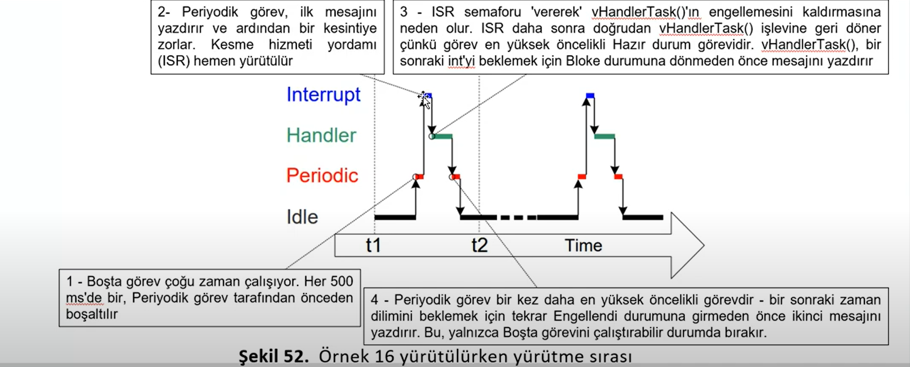
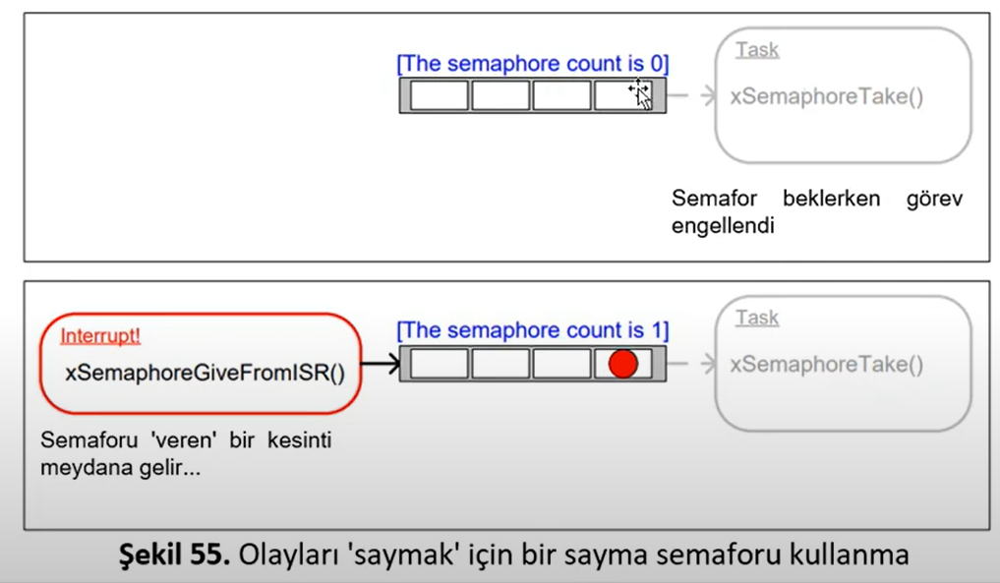
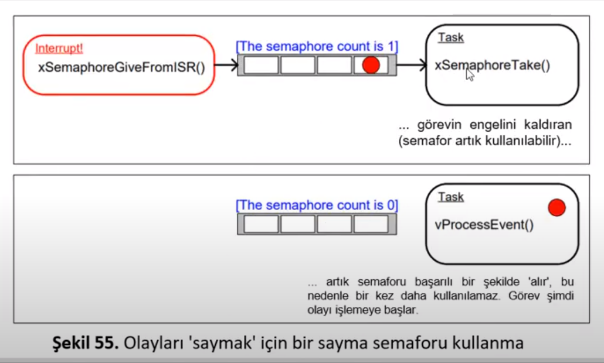
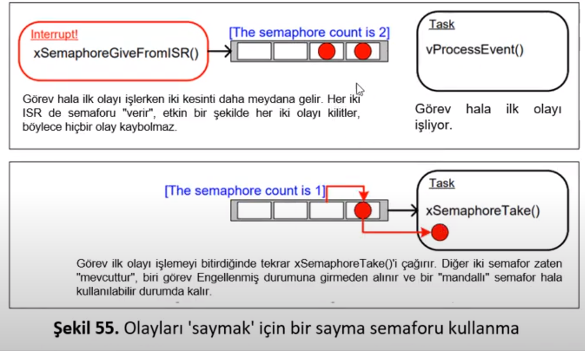
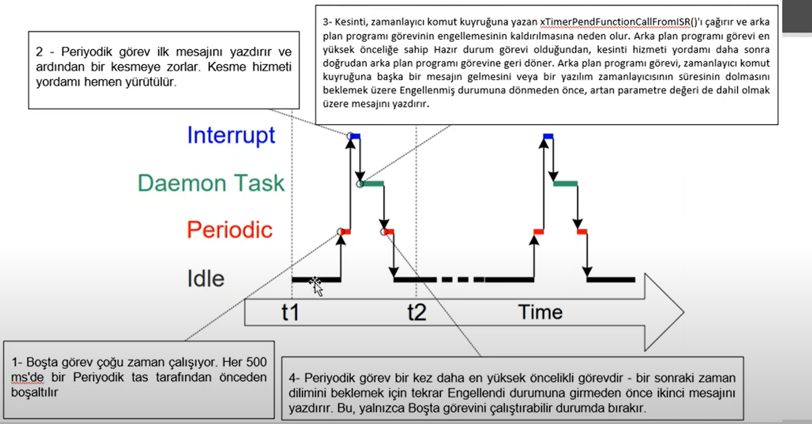
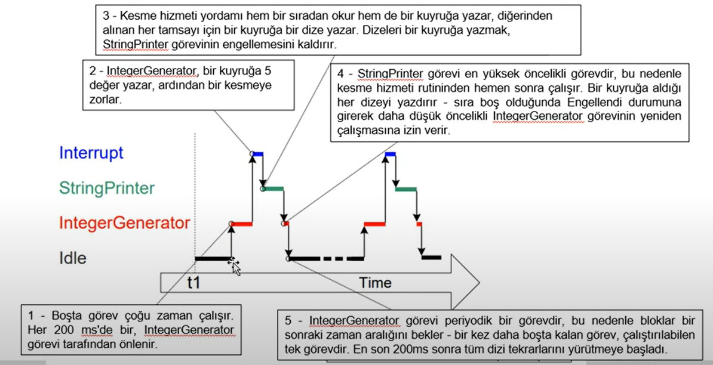
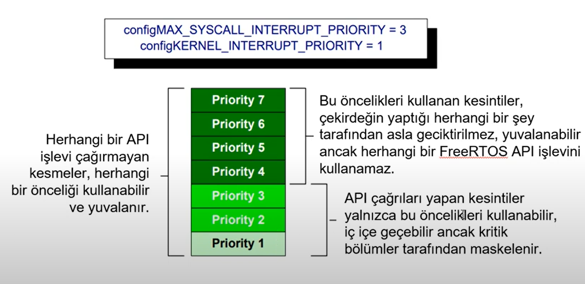

# **ISR MANAGEMENT** 

- ISR yönetimini doğru bir strateji çerçevesinde yapılmalıdır. ISR içindeki işlemler olabildiğince **minimum** seviyede tutulmalıdır. Öncelikler doğru bir şekilde ayarlanmalıdır. Hardware Interrupt **en yüksek öncelikli** tasktan önceliklidir.
- **Asla** adında <code>FromISR</code> bulunmayan bir fonksiyonu kesmede kullanmayınız.
- Interrupt routinin içerisinde veriyi bir data yapısıyla goreve iletip görevde process etmek daha iyidir.  

``` C
#define configUSE_PREEMPTION 1
```
- makrosu tanımlanarak görevler arasında yüksek öncelikli görev ready haline geldiyse ona geçmesini sağlar.

- Eğer ISR içerisinde daha yüksek öncelikli bir görevi çağırdıysak, <code>*pxHigherPriorityTaskWoken = pdTRUE</code> yapmamız lazım.Eğer bunu set etmezsek bir sonraki tick interrupt olayina kadar ready State'te kalır.
- Ayrıca  <code>*pxHigherPriorityTaskWoken</code> ilk defa kullanılmadan önce pdFALSE' eşitlenmelidir.

## Context Switching Macros
- **taskYIELD()** : Bir context-switching istemek için bir görev içerisinde çağrılabilen makrodur
- **portYIELD_FROM_ISR()** ve **portEND_SWITCHING_ISR()** -> **taskYIELD()** in güvenli versiyonlarıdır. ikisi aynı gorevi yapar. Fakat biz **portYIELD_FROM_ISR()** kullanacaz.
- Prototip : <code>portYIELD_FROM_ISR(xHigherPriorityTaskWoken)</code>.

- Eğer <code>xHigherPriorityTaskWoken</code> parametresi **pdFALSE** ise context-switching istemez ve makronun hiçbir etkisi olmaz. Bu makroların herhangi bir ISR içinden çağrılmasına izin verilir. Bazı küçük mimarilerde ISR rutinin sonunda çağrılmasına izin verilir.

## Ertelenmiş Kesme İşlemleri
- ISR'ları mümkün olduğunca kısa tutmak gerekir. ISR'lar bir görevin çalışma ve yürütme zamanını bozabilir(Jitter ekleyebilir). ISR anında erişilen değişkenler, çevre birimlerini kontrol ederken dikkatli olmak gerekir.
- Olabildiğince Nested Interruptlardan uzak durulması tavsiye edilir. ISR rutini kesmeyi hızlıca tamamlayıp asıl işi bir task içerisinde yapılmalıdır.Buna **ertelenmiş kesme işlemi** denir. 


## Senkronizasyon için Kullanılan ikili semaforlar
- **Semaphore** : Kelime anlamı Gösterge demektir. Aslında iki sistemi doğru bir şekilde haberleştirmek için kullanılır. Binary semafor (ikili semafor)bir ISR ile bir görevin **engellemesini kaldırmak** için kullanılabilir. Dolayısıyla görevi senkronize etmiş olur
- **portYIELD_From_ISR()** çağrılıp hızlıca diğer göreve geçilir(ISR). Sanki ISR ile görev bir bütünmüş gibi çalışır.


- Semaforlar, **Take Semaphore** ve **Give Semaphore** olarak anlandırılabilir. Binary Semaphore, 1 uzunluğuna sahip bir queue olarak uygulanabilir. Sıra ya boş ya dolu olduğundan ikili semafor olarak adlandırılır. **xSemaphoreTake()** çağıran ve ISR ' a bağlı bir görev, queue boşsa, çağrıldığı görevi engellenmiş duruma sokar. 

- ISR'da semaforu aktif etmek için **xSemaphoreGiveFromISR()** ile queue'ye token verilir. Engellenmiş task dolayısıyla bu durumdan çıkıp hazır duruma geçer. Kuyruktan okumayı yapar. Daha sonra tekrar okuduğunda kuyruğun boş olduğunu görünce tekrar engellenmiş duruma geçerek bekler.


- **xSemaphoreCreateBinary()** : İkili semafor oluşturmak için kullanılır. NULL değilse oluşturulamadı demektir. 
- Prototip : <code>SemaphoreHandle_t xSemaphoreCreateBinary(void)</code> 

- **xSemaphoreTake()** : Semaforu almak için kullanılır. Ancak mevcutsa alınabilir. Bir ISR içerisinde kullanılmamalıdır. **Özyenilemeli mutexler(Recursive)** hariç tüm FreeRTOS semaforları bununla alınabilir.
- Prototip : <code>BaseType_t xSemaphoreTake(SemaphoreHandle_t xSemaphore, TickType_t xTicksToWait);</code>

- **xSemaphoreGiveFromISR()** : ISR içerisinden semaforu vermek için kullanılır. **xSemaphoreGive()** fonksiyonun kesme güvenli versiyonudur.
- Prototip : <code>BaseType_t xSemaphoreGiveFromISR(SemaphoreHandle_t xSemaphore, BaseType_t *pxHigherPriorityTaskWoken);</code>



- xSemaphoreTake fonksiyonu genelde bir timeout değeriyle kullanılır. Eğer verilen timeout değerinde bu semaphore oluşmazsa xSemaphore take <code>pdFAIL</code> döndürecektir. Dolayısıyla burada bir hata durumunda ne aksiyon alıcağı konusunda bize kolaylık sağlamış olur. Bunun için <code>if(xSemaphoreTake(xBinarySemaphore, xMaxExpectedBlockTime) == pdFAIL)</code> şeklinde bir kontrol sağlayabiliriz.

- **Sayma Semaforları** : Birden fazla uzunluğa sahip kuyruklar olarak düşünülebilir.Görevler kuyruktaki verilerle **değil** kuyruktaki **öğe sayısıyla** ilgilenir. FreeRTOSConfig.h içerisinde aşağıdaki makro aktif edilirse kullanılabilirler. 
``` C
#define configUSE_COUNTING_SEMAPHORES 1
```

- Sayma Semaforları genellikle 2 durum için kullanılır
    1. **Olayları Sayma** : Bir olay her gerçekleştiğinde semafor verir. Olay işlendiğindede semafor azalır. Kuyruktaki semafor sayısı gerçekleşen olaylarla işlenen olaylar arasındaki farktır. <code>SemaphoreHandle_t xSemaphoreCreateCounting( UBaseType_t uxMaxCount,UBaseType_t uxInitialCount);</code>
    2. **Kaynak Yönetimi** : Bir kaynağın denetimini elde etmek için görev, önce semaforda elde edilmesi gerekir.Semaforun sayım değeri 0'a ulaştığında boş kaynak yoktur.Bir görev bittiğinde, semaforu geri vererek sayım değerini arttırır.
d
    
    
    


- **RTOS DEAMON** : Merkezi ertelenmiş kesme işleme noktasıdır.Bunu <code>xTimerPendFunctionCallFromISR()</code> ile yapabiliriz. Bu daha düşük kaynak kullanımını sağlar. Her interrupt için ayrı bir görev oluşturma ihtiyacını ortadan kaldırır. Basitleştirilmiş bir kullanıcı modeli sunar. Fakat daha az esneklik sağlar. Fakat verimli hafıza kullanımı sağlar.Ayrıca ertelenmiş görevler için ayrı ayrı öncelik ayarlamak mümkün **değildir**. Dolayısıyla hepsi **DEAMON** görevi önceliğinde yürütülür. Bu önceliği FreeRTOSConfig.h içerisindeki aşağıdaki makroyla ayarlarız. Bu yapıyı kullanmak daha az determinizm sağlar.
- Prototip : <code>BaseType_t xTimerPendFunctionCallFromISR(PendedFunction_t xFunctionToPend,void *pvParameter1,uint32_t ulParameter2,BaseType_t *pxHigherPriorityTaskWoken );</code>

``` C
#define configTIMER_TASK_PRIORITY (oncelik numarasi)
```


- **RTOS DEAMON** içerisinde kuyrukları kullanma : Semaforlar olayları iletmek için kullanılır. **xQueueSendToFrontFromISR()** kesme güvenli rutindir. Ayrıca **xQueueSendToBackFromIsr()** da kesme güvenli versiyondur. Ayrıca **xQueueReceiveFromISR()** da kesme güvenli versiyondur.
- Prototipler -> **xQueueSendToFrontFromISR()** -> <code>BaseType_t xQueueSendToFrontFromISR(QueueHandle_t xQueue, const void *pvItemToQueue,BaseType_t *pxHigherPriorityTaskWoken);"</code>
**xQueueSendtToBackFromISR()** -> <code>BaseType_t xQueueSendToBackFromISR(QueueHandle_t xQueue,const void *pvItemToQueue, BaseType_t *pxHigherPriorityTaskWoken);</code>
**xQueueReceiveFromISR()** -> <code>BaseType_t xQueueReceiveFromISR(QueueHandle_t xQueue,void *pvBuffer,BaseType_t *pxHigherPriorityTaskWoken);</code>

- ISR'dan Queue kullanılırken dikkat edilmesi gereken noktalar :
    1. Kesmeden göreve veri geçirirken Queue bize kolaylık sağlar. Ancak veriler sıklıkla geliyorsa Queue kullanmak verimli değildir.
    2. Karakteri almak için DMA kullanma. Bunun yazılıma bir yükü yoktur.Daha sonra veriye erişecek taskın engelleni kaldırıp işlem yapılır
    3. Algılanan her iş parçacığı güvenli bir RAM belleğe kopyalanır. Daha sonra taskin engellini kaldırırız.
    4. Alınan karakterleri doğrudan ISR içinde işleme

    

- NestedInterrupt : Karışıklığın ortaya çıkması yaygındır. FreeRTOSConfig.h içerisinde aşağıdaki makrolarla ayarlama yapıyoruz. Donanım ISR'ın ne zaman yürütüleceğine karar  verirken, yazılım taskların ne zaman yürütüleceğine karar verir. 

``` C
#define configMAX_SYSCALL_INTERRUPT_PRIORITY
#define configMAX_API_CALL_INTERRUPT_PRIORITY
```

