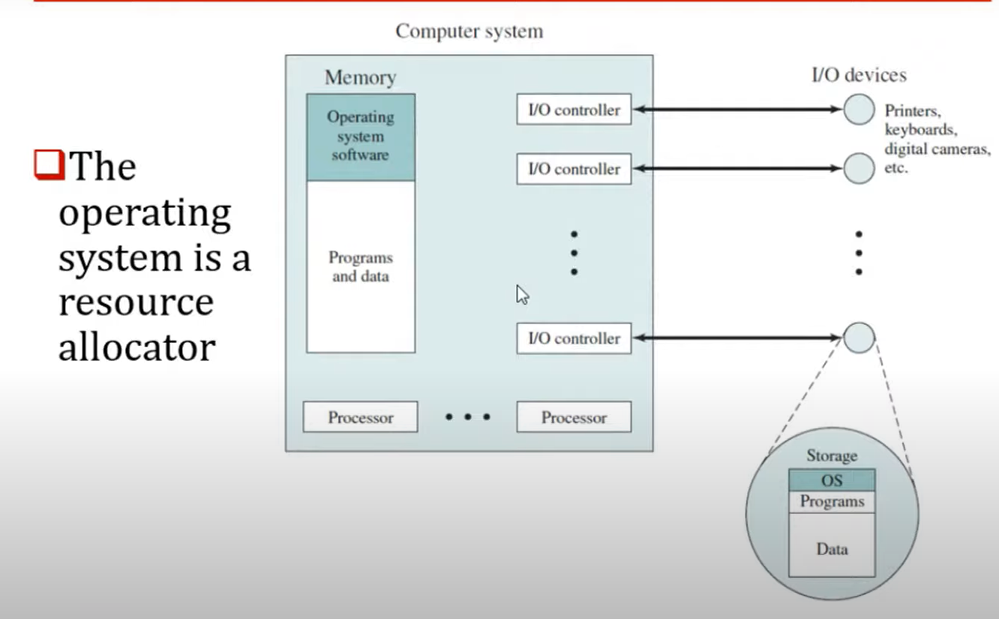

# REAL-TIME CONCEPT


## Chapter-1 : Understanding the Basic Concepts
- What is **System** : A system is mapping of a set of inputs into a set of outputs. f{In -> Qm};

- A system could be decomposed into smaller sub-systems

- A system may be one of components of larger system.


- What is **Real-Time System** : A Real-time system is a computer system that must satify **bounded response time constraints**. For the system operate correctly, Depends on both **functional correctness and timing correctness**. 


- **Failed System** : System that cannot satify one or more requirments stipulated

- Real-Time Systems are 2 types :
    1. Hard Real-Time : Timing requirments must be met precisly. Failure leads to significant failure.
    2. Soft Real-Time : Missing dead-line doesn't result in catastrophic effects.

- Constraints : There must be specification. Consist 2 type of constraints.
    1. Real
    2. Artifical 

- **Common Misconceptions**
    1. Real-time computing is equal to fast computing
    2. There is no science in real-time system design.
    3. Length of deadline makes a real-time system hard or soft.
    4. Advances in computer hardware will take care of real-time requirments.
    5. Real-time system research is equal to performance search.
    6. Real-time systems are fail-safe system.

## Chapter-2 Introduction to Operating Systems
- What is Operating System : Operating system is program that controls the execution of application programs, and acts an interface between application and computer hardware.


- Operating systems could be view 2 point
    1. User view
    2. System view

- Operating system provides abstraction to application layer.



- Operating system controls resources such as
    1. I/O
    2. Memory Space
    3. System's CPU
    4. File Storage Space
    5. Disk Storage

- Operating System have two main functions
    1. Providing abstraction to user program
    2. Managing resources.

- **Monolithic Kernel** : Entire OS runs as single program. Example : Linux
- **Micro Kernel** : It runs only basic process communcation and I/O control. Example : QNX MicroKernel

- **What is RTOS** : It's a program that 
    1. <code>Schedules execution in timely manner.</code> -> Most important one
    2. Manages system resources
    3. Provides consistent foundation for developing application code

- Also it could provide
    1. Priority based pre-emptive scheduling
    2. Constant and very low scheduling latency
    3. Very low and measurable interrupt latency


## Process, Threads, Scheduling
- **Program** : A set of instruction the user/programmer has written. Passive entity and continues to exist at a place

- **Process** : A program loaded into memory. A program in execution. Owns Resources
    1. Memory
    2. Open Files
    3. Identity
    4. Timers
    5. And more
- A resource manager with its own address space
- Resources owned by one procces are protected from other process. FreeRTOS is single process.


- **Threads** : Threads runs in process. A process must have at least one thread. Threads share resources all resources. There is no protection between threads.

- Threads share with other threads
    1. Timers
    2. Channels
    3. Connections
    4. Memory Access
    5. File pointers / Descriptors
    6. Single headers

- Each threads has its own stack, everything else is shared with other threads in same process.

- **Tasks and threads can be used interchangeably**. Most RTOS'es use the word task

- **Task** : A simple program thinks that it has all CPU all to itself. Contains Application code. Simple task structure is the following

``` C
void Task(void *p_arg)
{
    Do_something_with p_arg;
    Task initialization;

    // processing
    // do something or loop infinitly
    while(1)
    {
        // do operations
    }
    // delete self
}
```


## Scheduler
- The scheduler is heart of every kernel. Also called **dispatcher**.It determines which will run next and when.
- A thread or task. Most kernels schedule task/threads only 
- All Real-time kernels use pre-emptive priority based scheduling. This means The highest prority READy thread is one which get the CPU


- Pre-emptive, priority based scheduling can be augmented with round-robin scheduling which uses time slicing to achive equal allocation of CPU time between task of **same priority**


- Each executable task is assigned a fixed time quantum called **time slice**. A fixed rate clock is used to initiate an interrupt at rate corresponding to time slice.


## Context Switching 
- Each task has its own context
- Context switch occurs when scheduler switches from one task to another
- When task running its context highly dynamic, When task not running it context is frozen in stack space(TCB), restored when task runs again.
- Context switching takes some time to do its job. But this is relatively short time and mostly negleable. If application switching context so much, it could cause some unnecessary performance overhead.


- Interrupts has impact on scheduling algorithms. They cause scheduling latency.


- What affects scheduling latency
    1. Time spent in the interrupt handlers
    2. Priority of the thread scheduled
    3. Context switch time
    4. Scheduler latency
    5. Time spent in higher priority threads that are also ready

- **Idle Task** : Where there is "nothing to do" the CPU still executes instructions. The idle task runs when no other application tasks are able to run. It has lowest priority.

- **Who schedule the scheduler** : Scheduler is not scheduled. There is not a scheduler task. Scheduler is a function. It's executed 
    1. During System Call
    2. After an ISR processing. 

## Chapter-3 RTOS vs GPOS
- GPOS usualy try to give everything CPU time fairly. Most GPOS have **unbounded dispatch latencies**. Keep in mind GPOS are very good for what they designed for.
- RTOS based on **priority based pre-emptive scheduling**. RTOS sacrifice throughput for being deterministic. In RTOS **dispatch latencies** are **constant**. RTOSes are best suited for Real-time embedded systems.


- RTOS is just a tool. Using RTOS **does not** make a Real-Time system. Incorrect usage may end up with a system failure. Porting an application from GPOS to RTOS may require re-architecting. GPOS may tolarate design errors but RTOS **do not**.