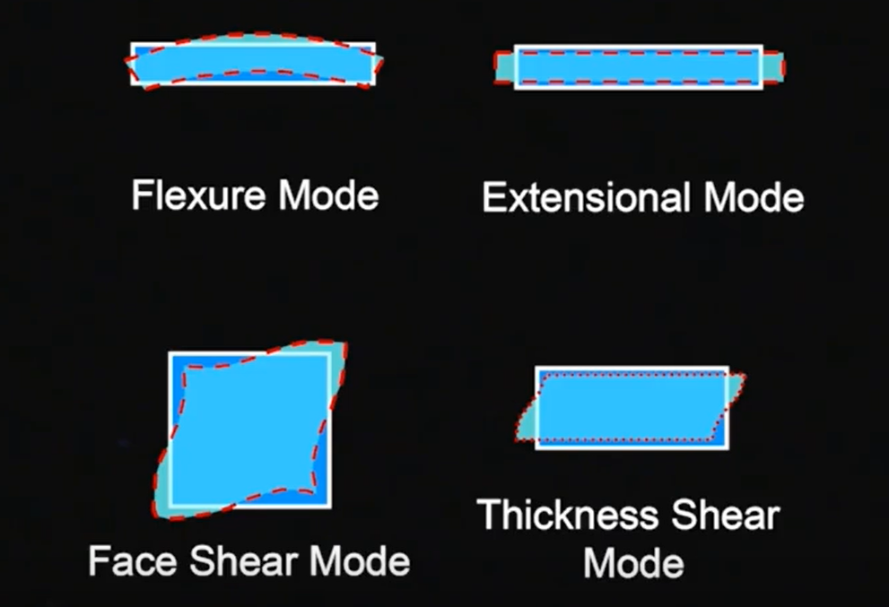

# Introduction to Quartz Crystals
- There is 2 types of crystals: AT-Cut, SC-Cut
-  In order to have oscilator, need to store and release energy mechanism.
- Quartz oscilators are much more efficent than LC-Oscilators
- Quartz oscilators are piezzo-electric.
- When voltage applied to quartz, one of mode below is happens. When remove voltage, quartz goes back to original shape.

- When building oscilators, fundamentally we put quartz with amplifier. Amplifier amplify the noise and apply voltage to quartz. Then quartz decharges on amplifier. This loop continues.

## Modes of a Crystal
- The crystal thicknes is inversely proportional to frequency.
- When overtone'ning the crystal, we can increase the signal frequency. Odd harmonics are for overtone.

## Crystal Cuts
- SC-cut : Round disk like cut.
- AT-cut has wider frequency span vs temperature swings, not as precise as SC-cut

## AT-cut vs SC-cut
- AT : XO, VCXO, TCXO, -> Picked for low power application, wide temperature range
- SC(Stree Compensated) : OCXO, EMXO, MCXO, Modules, -> High precision, Lower Vibration sensitivity

## Where Are Crystals Used ?
- Microprocessors, wrist-watches

## How is a Quartz Crytals Created ?
- Syntehtic quartz are created in chambers.
