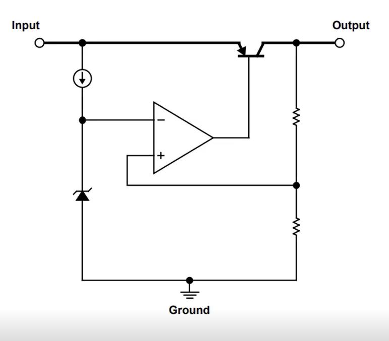

# LOW DROP OUT VOLTAGE BASICS

- LDO : Low drop out linear voltage regular.
- Low cost, high performance.
- The output voltage is determined by Vin - Vdropout over transistor.

## Why use Regulators ?
- Accurate supply voltage
- Active noise filtering
- Protection from overcurrent
- Inter-stage isolation
- Multiple output voltages
- Usefull in constant current sources

## Dropout voltage
- Dropout voltage is usually linear when current is increased.
- Dropout voltage is important. Always keep it in recommended range.
- When dropout voltage increases, heat dissiapted by IC will be increased.

- We can use mindi analog simulator from MicroChip to simulate LDO.

## Start-up and Soft-Start
- **Start-up Time** : Time needed by LDO to achive its %90 of typical output voltage level after when Input voltage is applied. 
- In some applications LDO can overshoot. That overshot is undesirable sometimes. To limit inrush current, softstart is applied.

## Quiescent Current
- Quiescent Current is represent the current used by IC. Iquiescent = Iinput - Ioutput
- Low Quiescent current helps with efficency

## Power Supply Rejection Ratio(PSRR)
- It is ability to reject unwanted signals.
- PSRR = 20 log(VinRipple / VoutRipple)
- It measured in certain conditions, and represented in decibels

## Shutdown Control -> SHDN
- The shutdown input turn on-off the LDO. 
- When LDO turned on LDO output voltage is enabled.

## Noise
- Regulators generates noise. 
- When transistors are used noise always generated. Flicker noise is produces by transistors
- To reduce noise, bypass capacitors are cruicals.

## Thermal Dissiption
- Like other semiconductor devices LDO dissipated heat by heat sink. Pin = Pout + Pldo