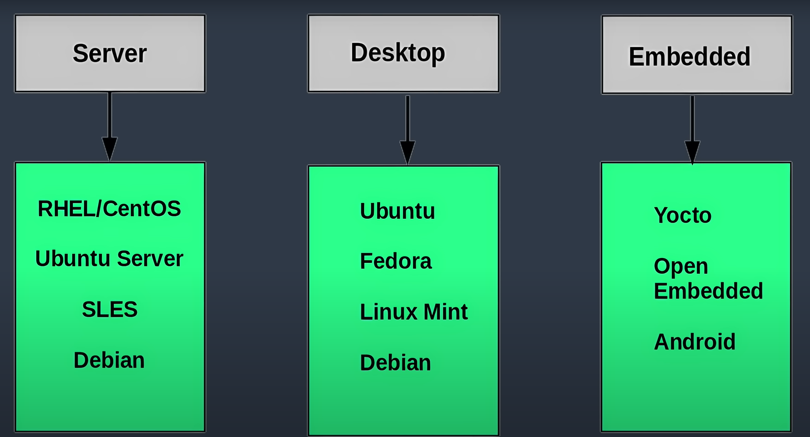

# INTRODUCTION TO LINUX

## Introduction to Linux Families
- There are mainly 3 different distrobution families
    1. **Red Hat** family (RHEL) : CentoS, Fedore, Oracle Linux
    2. **OpenSuse** family
    3. **Debian** family

    
### Red-Hat Distrubition Families
- Fedore used as testing platform for future Red-HAT releases.
- CentOS is close clone of RHEL
- Suuports Intel x86, ARM, Itanium, PowerPC
- yum package manager.
- Widely used by enterprise.

### SUSE Distrubition Families
- OpenSUSE used as reference distro.
- RPM based package manager
- Widely used in retail

### Debian Distro Families
- Commonly used servers and desktop pcs.
- focused on stability. Most complete software repos.
- DPKG-based apt package manager.
- Widely used for cloud deploymments
- GNOME based UI

## Linux Philosophy and Concepts 
- <code>man</code> this command gives us manual for given topic.
- <code>kernel</code> : Glue between hardware and application.
- <code>Distribution</code> : Collection of software making up a Linux-based OS
- <code>Boot-loader</code> : Program that boots the operating system
- <code>Service</code> : Program that run as a background process
- <code>FileSystem</code> : Method for storing and organizing files
- <code>Command Line</code> : Interface for typing commands on top of the operating system
- <code>Shell</code> : Command-Line interpreter that interprets the command line input and instructs the operating system to perform any necessary tasks and commaknds
- Linux borrows alot of ideas from UNIX
- Linux accesses features through files. 
- Linux is a multitasking OS

## Linux Basics and System Start-up
- Boot Process : Power ON -> BIOS -> Master Boot Record also known as First Sector of the Hard-Disk -> Boot-Loader(GRUB) -> Kernel(Linux OS) -> Initial RamDisk(initramfs image) -> /sbin/init(parent process) -> Comand Shell using getty -> X Windows System(GUI) 

- **BIOS** : Initialize screen and keyboard, Also know power-on-self-test
- **MBR** : Bootloader loaded from harddisk.
- After first stage bootloader finish its job, it search for second stage bootloader and it launches it.
- Second stage bootloader, launches kernel.
- **Initial RAM disk** : Mounts filesystem for OS or loading Device drivers in order to them work properly Init also calls the shell. If you write your crediantals you will be login to Shell. If you are running GUI you wont see it.
- **Kernel** : Configures the memory and all hardware attached to system. Loads user necessary applications. Then kernel runs /sbin/init. sbin/init starts other process to get the system running.
- **systemd** starts system faster. It is adopted by most distros. 
- **systemctl** : Controls systems processes.

- FileSystems  Supported by Linux
    1. **Conventional disk filesystems**. (ext3, ext4, XFS, Btrfs, JFS, NTFS, vfat, etc..)
    2. **Flash Storage filesystems** : (ubifs, jffs2, yaffs, etc..)
    3. **Database filesystems**
    4. **Special Purpose filesystems** : (procfs, sysfs, tmpfs, squashfs, debugfs, etc..)

- Partition is physical container for file system
- Filesystem can be reside in multiple partition.
- Linux systems are use FileSystem Hierarchy Standart(FHS)

- All files on Linux system are case-sensetive.

## Graphical User Interface
- Session manager + Window manager + a set of utilities = Seamless desktop environment
- GNOME is very popular desktop enviroment
- KDE is also popular desktop enviroment
- GNOME tweaks are lets you customize your system for yourself.
- Hidden files names starts with **.**

## System Configuration from the Graphical Interface
- Linux always uses UTC. Which is more correct than GMT
- dpkg-installer is upstream by apt(advanced package manager)(Debian-based)
- rpm-installer is upstream by yum(RedHat based)
- yast is openSUSE based.

## Common Applications
- Internet applications
- Office Productivity Suites
- Developer tools
- Multimedia applications
- Graphic editors

## Command Line Operations

- sudo command allow user to run programs with administrative priviledges.
- man shows manual for given program
- if sudo is not enabled by default you can use <code>echo "student ALL = (ALL) ALL" > /etc/sudoers.d/student</code> for student user. also <code>chmod 440 /etc/sudoers.d/student</code> is written
- We can stop GUI with command line. <code>sudo systemctl stop gdm</code> or <code>sudo systemctl start gdm</code>
- <code>cd - </code> : Goes to previous directory.
- <code>.</code> : Present directory
- <code>..</code> : Parent directory
- <code>~</code> : Your Home directory
- <code>tree</code> : Display a tree view of the filesystem

- Links are powerfull tool in Linux
    1. **Hard Link** : Created by <code>ln file1 file2</code>, there is only 1 file but 2 differnt name gets associated with it. They are very usefull and save space. 
    2. **Soft(Symbolic) Link** : Created by <code>ln -s file1 file3</code> or <code>ls -li file1 file3</code> 

- <code>pushd</code> and <code>popd</code> can be used to to store directory in stack to remember paths later.
- <code>touch</code> : Update timestamp value or create a given name file.
- <code>mkdir</code> : Create directory.
- <code>rmdir</code> : Removes directory.
- <code>mv</code> : Used to move file or rename file.

- There is standart file streams always open in regular use. 
    1. Standart Input -> **stdin** -> Value : 0
    2. Standart Output -> **stdout** -> Value : 1
    3. Standart Error -> **stderr** -> Value : 2

- When otherfiles are open they start from 3 and increase from there.
- Through command shell, file output can be redirected.
- <code>do_something 2> error-file</code> : Do something stderr(file descriptor 2) output is directed to error-file
- Unix/Linux philosophy is create small programs to create quite complex program by combining them. To accomplish this, **pipes** are used. <code> command1 | command2 | command3</code>
- Pipes reduces writing and reading from disk. Disk is mostly bottle neck of programs. Avoiding this speed up the process. 
- **locate** and **find** utilities are used to find files in disk.
- locate utility uses previously constructed database.
- While searching for file, we can use **wildcard** :
    1. ? -> Matches any single character
    2. Matches any string, not have to be single char -> *
    3. Matches any character in the set of characters [set]
    4. Matches any character not in the set of characters [!set]

- When using wilcard, putting something in quotes it wont just search in current directory. It is good to be safe.
- find program when used with no argument it search in current directory. **-name** list files with given patterns in name. **-iname** ignore the cases given with name. We can also find files with their attributes. When created, when modified, size, etc..

- Additional software is used via **package manager software**
- Both rpm and dkpg runs on two-level.
    1. **Low level tool** : dpkg or rpm, take care all low level stuff. install packages, run scripts, make sure software installed correctly
    2. **High level tool** : apt, yum or zypper dnf, dowload packages, figures out dependencies. User works in this level.
    
- dnf is backward-compatiable with yum for RHEL
- zypper is for openSuse family.
- to search for given packages on debian based system, <code>sudo apt-cache search package_name</code>

## Finding Linux Documentation
- The man pages, Command help, GNU info, and other documentation sources are helpful.
- To list all topics on given command <code>man -f sysctl</code>
- <code>info make</code> : Gives info about make command.

## Processes
- Process is one or more task, threads executing on your computer.

- Scheduler gives CPU time to processes.

- To terminate process <code>kill -9 pid</code> kills the process or <code>kill -SIGKILL pid</code>
- The operating system identifies who started the process by RUID(Real user id)
- RGID -> Identifies the group that started tthe process, 
- EUID -> Determines the access rights of the user
- EGID -> Determines the access rights of the group

- with <code>nice</code> we can change process priority. The lower the nice value, the higher the priority.
- <code>ps</code> command shows currently running processes.
- <code>ps lf</code> : Shows priority of currently running processes.
- <code>renice -5 pid</code> : Decrease(Increase priority) niceness value of pid by 5
- Load average is load value for given time. Take account threads are waiting to run or sleeping to wait on resource.
- For single core system calling <code>w</code> means first load average value is cpu is utilize for last minute percentage. second value is last 5 minute and other value is for last %15 minute
- foreground jobs are run in foreground.
- background jobs frees the shell and run in background.
- Ctrl k suspend running foreground job.
- <code>jobs</code> : Shows jobs running in background.
- <code>top</code> : Show currently running processes. When inside <code>top</code> pressing h shows all help info.
- <code>at</code> : Used to schedule task at specified time
- <code>cron</code> : Used to schedule task at specified time. Drived by configured table, called cron table.
- <code>sleep</code> : Suspend execution for given time.

## File Operations
- Everything is file. Atleast is threated as such.
- Root directory is not same as root user.

- Linux supports variety of file system types. Such as : Reiser4, Xiafs, ReiserFS, SquashFS, btrfs, ext2, ext3, ext4, XFS, Bcachefs, ext, JFS.

- bootloader and system stuff keep on different partition. User space kept in different partition and temporary variables kept in different partition. This kind of isolation is pretty usefull.

- Before you can use filesystem, it should be mounted on file system tree. <code>mount</code> command use unmounted file system to be mounted on somewhere in system.
- When system starts up, if you want mount on system, /etc/fstab edit it accordingly.
- NFS is network file system. 
- Each user has home directory. /root directory is home directory for root user.
- /bin contains executable binaries. /sbin for system administration. /usr/bin are used for not essential for system bin placed here. 
- /proc contains virtual files. Files only rezides in RAM. Runtime System information.
- /dev directory contains devices nodes. Used for most hardware and software devices. Created dynamically when devices found.
- /var contains files expected to change size and content.
- /etc contains system configuration. Contains no binaries. But contains script files.
- /boot contains few essential files for system booting.Some of them are below
    1. **vmlinuz** : The compressed Linux kernel, required for booting
    2. **initramfs** : The initial ram filesystem, required for booting, sometimes called **initrd** not initramfs
    3. **config** : The kernel configuration file, only used for debugging and bookkeeping.
    4. **System.map** : Kernel symbol table, only used for debugging.
- /lib or /lib64 for essential programs libraries. Also known as shared libraries or dynamical linked libraries.
- /media, /run, /mnt for removable drives. 
- /opt : Optional application software packages
- /sys : Virtual pseudo-filesystem giving information about the system and the hardware. 
- /srv : Site-specific data served up by the system
- /tmp :: Temporary files
- /usr : Multi-user application, utilities and data.

- <code>diff</code> : Compare files and directories. Used for text files. For bin files <code>cmp</code> could be used.
- <code>patch</code> : Patch changes on older version of file.
- In Linux file extension doesnt mean much. Just giving info to user. Most application check content instead of extension.
- FHS : File Hierarchy System

## Text Editors
- Basic Text Editors
    1. **nano** : 
    2. **gedit** : 
- Advanced Text Editors
    1. **vi** : 
    2. **emacs** : 
    
- Writing <code>vimtutor</code> : launches vim tutorial. 
- Vi provides 3 modes
    1. **Command**
    2. **Insert** 
    3. **Line**

## User Enviroment
- <code>whoami</code> : For Identifying who is logged in.
- <code>who</code> : List currently logged in users.
- Linux is multi-user operating system.
- Only root user allowed to add and remove users.
- With aliases we can create customized commands or modify existing commands behaviour
- Access rights to files and devices are granted user and usergroups they belong to.
- /etc/skel directory is blue print for newly created users.
- Enviroment variables are just character string contains information.
- In Unix/Linux based operating system, everyfile is associated with owner of file.
- <code>chown</code> : Used to change user ownership of a file or directory
- <code>chgrp</code> : Used to change group ownership
- <code>chmod</code> : Used to change the permissions on the file, which can be done separately for owner, group, and the rest of the world

## Manipulating Text
- <code>tac file</code> : Prints file content in reverse order lines.
- <code>sed</code> : It is used to modify file content.
- <code>awk</code> : Extract specific information. It is used to process information textfiles. Short **awk** commands can be used in commandline. but longer versions can be used with <code>awk -f scriptfile filename</code>
- <code>sort</code> : Sort words in textfile.
- <code>Uniq</code> : Removes duplicates in text file
- <code>paste</code> : paste used to create single file from couple file.
- <code>join</code> : joins 2 text file without repeating same data.
- <code>split</code> : Used to split file into segments.

- Regular expressions are text strings used for matching specific pattern or search for specific location(in text)
- <code>grep</code> : Primarly used as text searching tool.
- <code>strings</code> : Used to extract all printable strings found in files. Usefull when locating in printable strings in binary files.
- <code>tr</code> : translate specified characters to other characters or to delete them.
- <code>tee</code> : Takes output of any command and direct it to standart output and saving it to file
- <code>wc</code> : Count number of words in file.
- <code>cut</code> : Manipulates column based files.

## Network Opeartions

- Internet is called networks of network.
- ssh : Secure shell. It is secure connection to remote server.
- scp : Secure copy. It moves data between 2 host.