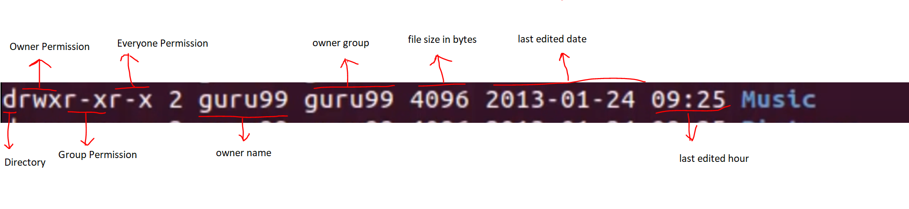

# LINUS TUTORIAL FOR BEGINNERS : INTRODUCTION TO LINUX OPERATING SYSTEM
- Kernel is in heart of every operating system.
- Linux is operating system created by Linus Torvalds.
- A Linux based server could run non-stop without a reboot for years on end
- Linux files are all under root directories
- In linux almost everything is file
- General files are called **ordinary files**. They can be ASCII or binary. They are most commonly used.
- Directory files are warehouse for other file types.
- Root also called super user.
- Linux is case sensetive.
- Unix/Linux uses **tree like hierarchical file system**, There are no drives in Linux
- Peripherals like hard drives, Cd-rom, printers also considered files in Linux/Unix
- There are 3 types of account types
    1. Regular
    2. Root
    3. Service Account

- <code>cat > file.txt</code> : Creates file.txt and lets you write in it. Press Control + D to save content.
- <code>cat > file1.txt file2.txt > newfile.txt</code> : Combines file1.txt and file2.txt into newfile.txtk
- Use <code>Control + Shift + V</code> to copy in terminal

## FILES
- There are 3 type of access 
    1. **User** : Who created the file becomes owner
    2. **User group** can contain multiple users. All user in the group can have the same file permissions
    3. **Other** : Any other user who have access to file, Doesnt own the file. Doesnt belong to usergroup.
- Linux has 3 different types of permissions. 
    1. **Read**
    2. **Write**
    3. **Execute**

- <code>chmod</code> : Change file permissions
- <code>chown</code> : Changing ownership of file

- 2 group cannot own the same file. One group can be sub group of other group.
- <code>pr</code> : Print out to terminal.
- <code>lp</code> : printing n copies of file.

- In linux, programs are distributed as packages.
- **apt-get** : used to install packages.

## Redirection in Linux
- In Unix/Linux world everything is file. Every file has a number called file descriptor. File Descriptor FD0 -> Stdin, FD1 -> Stdout, Stderr -> FD2
- **>** : Used for output(stdout) redirection.
- **>>** : This used for  appending. Instead of overwrite.
- **<** : It is used for input(stdin) redirection.
- **&**  : It is used for error(stderr) redirection. or **2>**.

- Pipes are used to run two or more commands **consecutively**
- **grep** : can scan a document, present the result in a format you want.
- **sort** : sort results alphabetically
- When we use pipes, output of first command is given to second command as input

## REGULAR EXPRESSIONS
- most common ones are **tr**, **sed**, **vi**, **grep**.
- They can be also used as interval regular expression. Or extended regular expression.(Combimes more than one regular expression.)

## Enviroment Variable
- Enviroment variables are
    1. Can store dynamic values
    2. Exist in every operating system
    3. Can be created, edited, saved and deleted
    4. Gives information about the system behaviour
    5. Change the way software programs behave.

- Enviroment variables are created by upper case : <code>NEWVARIABLE=value123</code>
- Deleting enviroment variable : <code>unset NEWVARIABLE</code>
- Set existing enviroment variable value : <code>export NEWVARIABLE=value</code>

## Communication in Linux
- FTP : File Transfer Protocol.
    1. Logging in and establishing a connection with a remote host
    2. Upload and download files
    3. Navigating through directories
    4. Browsing contents of the directories
- <code>ftp given_ip_adress</code> : Connection established with this command.

- telnet connect to remote linux.
- Run programs remotely and conduct administration
- Usage : <code>telnet ip_address_or_hostname</code>

- **ssh** : Secure shell. Securly connect to a remote computer. 
- <code>ssh username@ip_adress</code>
- Communication between Linux/Unix and other different computers, networks and remote users is possible

## Process
- An instance of program is called a process.They are 2 types
    1. **Foreground Processes** : They are running in foreground
    2. **Background Processes** : They are running in background.

- <code>top</code> : gives information about running processes.
- <code>ps ux</code> : Shows all process running under current user.
- <code>kill PID</code> : Kills process with PID process id.

- We can change process priority by niceness value. Lower the niceness index, higher would be the priority.
- <code>nice -n nice_value process_name</code> : Change process_name priority with nice_value
- renice command used for changing process priority.

- **df** : Show all disk properties on system.
- **free -m** : Shows all available memory in system
- <code>pidof process_name</code> : Gives PID of process_name.

## VI Editor
- It is available in almost all Linux Distros.
- It works the same across different platform
- It is user friendly.

- Vi can be in two mode
    1. **Command Mode** : Move the cursor and cut, copy, paste the text. Save the changes to the file. Commands are case sensitive
    2. **Insert Mode** : This mode is for inserting text to file. Press <code>i</code> on the keyboaard to enter insert mode. Presse Esc key to save changes and return to return command mode.
- <code>vi filename</code> : Open filename with vi.

## Shell Scripting
- There are 2 types of shell
    1. **$** : Bourne Shell -> Bash, POSIX Shell -> sh, Korn Shell -> sh
    2. **%** : C Shell -> csh, Tops C shel -> tcsh

- Writing series of command is **shell scripting**. Combine lengthy and repetitive commands. This helps reduce the efforts
- **Kernel** is the nucleus of the operating systems and it communicates between hardware and software.

## Introduction to Perl
- Its a programming language for text editing. Used for Create programs, Handles databases and emails, GUI development, Networking and System administrating. 
- Perl is prefered over shell scripting. Error handling is very easy on perl. Writing long and complex programs on Perl is easy. Shell is less secure.
- Every statement ends with Semi-colon
- Perl is case-sensitive.
- Perl is **general-purpose programming language** originally developed for text manipulation.
- Perl files have **.pl** extension.

## Virtual Terminals
- Linux is multi user system. Which allows multiple people work on it simultaneously. 
- Used for executing commands and offering input. You cant use mouse on it. Just use keyboard shortcuts. Ctrl + ALT + F1 opens virtual terminal. To navigate between virtual terminals use Ctrl + Alt + F1 to F6 keys

## Unix Administration
- <code>sudo add adduser username</code> : Adds user with username